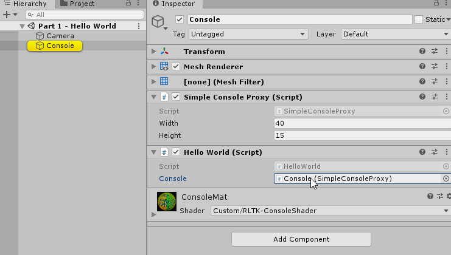
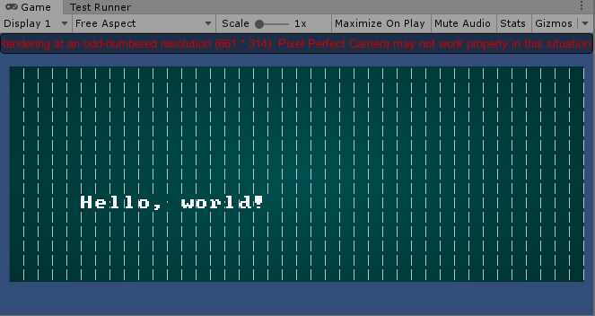

#### [« Previous: Introduction](../../Introduction.md) —  [Next: 1.1 - ECS »](../1.1-ECS/README.md#10---writing-to-the-console)

--------

# 1.0 - Writing to the Console

These tutorials will always be free and the code will always be open source. With that being said I put quite a lot of work into them. If you find them useful, please consider donating. Any amount you can spare would really help me out a great deal - thank you!

[](https://www.paypal.com/cgi-bin/webscr?cmd=_s-xclick&hosted_button_id=Y54CX7AXFKQXG)

----------------------

This chapter demonstrates the simplest way to set up and write to a console. You can create a console using the menu item "GameObject/RLTK/Initialize Simple Console":


This will spawn a `SimpleConsoleProxy` in the scene and set up a `LockCameraToConsole` component on the camera:





The `SimpleConsoleProxy` is a MonoBehaviour which internally uses a `SimpleConsole` for rendering. 

The `LockCameraToConsole` component will automatically adjust the camera to correctly render the console. When you press play you might notice rendering artifacts depending on the size of your viewport:



The artifacts should disappear when the viewport resolution (both x and and y) is even:


We write to the console in the `HelloWorld` component on the console GameObject:

```
    public class HelloWorld : MonoBehaviour
    {
        SimpleConsoleProxy _console = null;

        private void Awake()
        {
            _console = GetComponent<SimpleConsoleProxy>();
        }

        private void Start()
        {
            _console.Print(5, 5, "Hello, world!");
        }
    }
```

And finally you can tweak the appearance of the console itself from the Material:


The next chapter focuses on giving a brief summary of ECS and shows a simple way to create and render dynamic entities using ECS and a `SimpleConsole`. 

--------

#### [« Previous: Introduction](../../Introduction.md) —  [Next: 1.1 - ECS »](../1.1-ECS/README.md#10---writing-to-the-console)