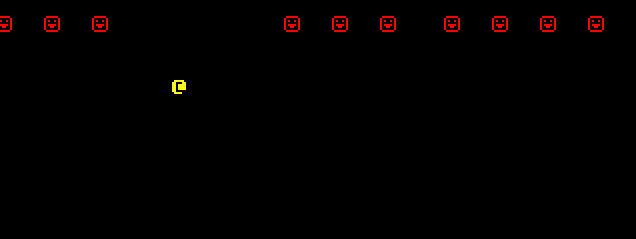

#### [« Previous: 1.0 - Writing to the Console](../1.0-WritingToTheConsole/README.md#10---writing-to-the-console) —  [Next: 1.2 - Walking a Map »](../1.2-WalkingAMap/README.md#12---walking-a-map)

# 1.1 - ECS

These tutorials will always be free and the code will always be open source. With that being said I put quite a lot of work into them. If you find them useful, please consider donating. Any amount you can spare would really help me out a great deal - thank you!

[](https://www.paypal.com/cgi-bin/webscr?cmd=_s-xclick&hosted_button_id=Y54CX7AXFKQXG)

----------------------

In this chapter we use Unity's ECS system to track some entities and render them in the console using their positions. We also create a player that we can move around in the console.

As of this writing Unity's ECS framework is **very much** in development. The API seems to be stabilizing but there's a good chance that some aspects could change in the future and things in this tutorial might not be up to date with the latest changes. This tutorial was written using the Entities package v[0.5.0].

## Why Use ECS

I don't think I could come up with a better explanation of why one would want to write a game using ECS than the one from [TheBracket's tutorial](https://bfnightly.bracketproductions.com/rustbook/chapter_2.html#about-entities-and-components), which this tutorial is based off of. I want to highlight one particular paragraph:

```
For small games, an ECS often feels like it's adding a bit of extra typing 
to your code. It is. You take the additional work up front, to make life 
easier later.
```

This, in my experience, has been the biggest benefit of ECS. It scales very well, it reduces coupling inherently by *forcing* you to separate your data from your behaviours and it forces you to think about and format your data in a way that your computer can process very efficiently.

I am not saying one can't accomplish these things in OOP. But the bottom line is ECS makes it easier for *me* to write cleaner and faster code.

## Learning the "Basics" of ECS

Now with all that being said - I couldn't possibly hope to exhaustively explain every aspect of Unity's ECS and Job system. There's a lot to cover, and while the concept of ECS has been around for a long long time, *Unity*'s ECS is fairly new and being actively developed. While you're learning you'll need to be able to do some research for yourself, dig into the source, and make liberal use of the documentation.

If you're new to ECS, I would **strongly** recommend these resources to learn the basics:
 * [The Unity ECS Samples](https://github.com/Unity-Technologies/EntityComponentSystemSamples/tree/master/ECSSamples/Assets/HelloCube) are a fantastic starting point. The "HelloCube" examples are extremely small and simple and the readme for each example gives a very clear explanation of what the code is doing. Don't even bother with anything else until you *thoroughly* understand what is happening in these samples. Download them, tinker around with them, and get familiar with them. As I said they are all very basic so it shouldn't take too long. 
 * [Getting Started with DOTS: Scripting Pong](https://www.youtube.com/watch?v=a9AUXNFBWt4) is a fantastic video. As of this writing it's the only up-to-date video tutorial from Unity that demonstrates how to write a simple game using ECS.
 * [The ECS Manual](https://docs.unity3d.com/Packages/com.unity.entities@latest) is essential while getting comfortable with the API. The manual itself is still being developed but it's come a long way. I highly recommend you keep the following pages open in another tab while you're learning ECS:
    * [General Purpose Components](https://docs.unity3d.com/Packages/com.unity.entities@0.5/manual/component_data.html)
    * [JobComponentSystem](https://docs.unity3d.com/Packages/com.unity.entities@0.5/manual/job_component_system.html)
    * [The Conversion System](https://docs.unity3d.com/Packages/com.unity.entities@0.5/manual/gp_overview.html#authoring-overview)
    * [Using JobComponentSystem and ForEach](https://docs.unity3d.com/Packages/com.unity.entities@0.5/manual/entities_job_foreach.html)

The last page in particular is a big one, but it's essential once you're comfortable writing systems and components. It thoroughly demonstrates all the proper ways to access and modify your entities while leveraging the job system and burst compiler to keep everything running as fast as possible.

If you're completely new to ECS, don't expect it to come to you easily. It requires you to structure your code in a very specific way. You will need to constantly refer back to the manual and examples to be able to solve problems on your own. Googling will help, but be careful about finding out-of-date information, the most up to date information will always be in the links I provided above.

If you're struggling and can't figure something out on your own with the resources above, feel free to [ask in the official Unity discord](https://discord.gg/unity) (make sure you go to the "#Dots" channel for ECS related questions) or ask [on the forums](https://forum.unity.com/forums/data-oriented-technology-stack.147/). There's almost always people around willing to help, as long as you don't expect them to do all the work for you!

## Rendering the Console

Now with all that being said, I'll give a brief overview of the different pieces of this chapter. First, rendering the console. Since we're using ECS, relying on the `SimpleConsoleProxy` is more trouble than it's worth. Instead we create and render a `SimpleConsole` entirely from code inside [RenderSystem.cs](RenderSystem.cs):


###### RenderSystem.cs
```
[DisableAutoCreation]
[AlwaysSynchronizeSystem]
public class RenderSystem : JobComponentSystem
{
    SimpleConsole _console;

    protected override void OnCreate()
    {
        _console = new SimpleConsole(40, 15);
    }

    protected override void OnStartRunning()
    {
        RenderUtility.AdjustCameraToConsole(_console);
    }

    protected override void OnDestroy()
    {
        _console.Dispose();
    }

    protected override JobHandle OnUpdate(JobHandle inputDeps)
    {
        _console.ClearScreen();

        Entities
            .WithoutBurst()
            .ForEach((in Position pos, in Renderable renderable) =>
        {
            var p = (int2)pos.Value;
            _console.Set(p.x, p.y, renderable.FGColor, renderable.BGColor, renderable.Glyph);
        }).Run();

        _console.Update();
        _console.Draw();

        return inputDeps;
    }
}
```

I applied the [DisableAutoCreation] attribute because I want the systems for each chapter to be created only when that chapter's scene is loaded. This is accomplished with the [Part1_1Bootstrap](Part1_1Bootstrap.cs) class, which is derived from the utility [Bootstrap](../../Common/Bootstrap.cs) inside the "Common" folder.

The lifetime isn't managed automatically by our `SimpleConsoleProxy` anymore so we have to do it ourselves. We create the console inside `OnCreate` and dispose in `OnDestroy`. 

In the previous chapter we used the `LockCameraToConsole` component to adjust the Camera. That component is made to work with the `SimpleConsoleProxy`. Since we aren't using that we can instead use the RLTK class `RenderUtility` to automatically adjust the camera to our console's size inside `OnStartRunning`. We can't call that from `OnCreate` since the Camera's GameObject will not have been created yet at that point.

Inside `OnUpdate` we clear the console and iterate over all our entities and draw them to the console. Finally we call `Update` and `Draw` to render the console:


## Creating the Entities

The entities (the yellow player and the little red smileys) are created from the [CreateEntities](CreateEntities.cs) script:

###### CreateEntities.cs
```
public class CreateEntities : MonoBehaviour, IConvertGameObjectToEntity
{
    public void Convert(Entity entity, EntityManager dstManager, GameObjectConversionSystem conversionSystem)
    {
        var em = dstManager;
        var player = entity;
        dstManager.AddComponentData<Position>(player, new float2(10, 8));
        dstManager.AddComponentData<Renderable>(player, new Renderable
        {
            FGColor = Color.yellow,
            BGColor = Color.black,
            Glyph = RLTK.CodePage437.ToCP437('@')
        });
        dstManager.AddComponentData<InputData>(player, new InputData());

        for (int i = 0; i < 10; ++i)
        {
            var e = conversionSystem.CreateAdditionalEntity(gameObject);
            var renderable = new Renderable
            {
                FGColor = Color.red,
                BGColor = Color.black,
                Glyph = RLTK.CodePage437.ToCP437('☺')
            };
            dstManager.AddComponentData<Position>(e, new float2(i * 3, 13));
            dstManager.AddComponentData(e, renderable);
            dstManager.AddComponentData(e, new MoveLeft { Speed = 15 });
        }
    }
}
```

This is a nice and straightforward way to create entities using the [ConversionSystem](https://docs.unity3d.com/Packages/com.unity.entities@0.5/manual/gp_overview.html#gameobject-conversion). I didn't do it in this case, but since this is a MonoBehaviour you can easily expose values in the inspector that you can use to customize entity creation through the editor before you hit play - such as tweaking colors or changing the number of entities you spawn.

Note the `conversionSystem.CreateAdditionalEntity` calls. You might intuitively think you should create additional entities via `dstManager.CreateEntity`, but inside an `IConvertGameObjectToEntity` script you must use `CreateAdditionalEntity` and pass in the converting GameObject for it to work properly.


## Movement

For the non-player entities movement is handled by the `MoveLeftSystem`, which iterates over all entities with a `MoveLeft` component and a `Position`:

###### MoveLeftSystem
```
    Entities.ForEach((ref Position p, in MoveLeft move) =>
    {
        p.Value.x -= move.Speed * dt;
        if (p.Value.x < 0)
            p.Value.x = 39;
    }).Run();
```

When they reach the left edge, it snaps them back to the right edge so they can continue their left-ward journey.


The `ReadInputSystem` and `MovePlayerSystem` inside [InputHandling.cs](InputHandling.cs) are how we can move the player around:

###### ReadInputSystem
```
    [AlwaysSynchronizeSystem]
    public class ReadInputSystem : JobComponentSystem
    {
        TutorialControls _controls;
        InputAction _moveAction;

        protected override void OnCreate()
        {
            _controls = new TutorialControls();
            _controls.Enable();
            _moveAction = _controls.DefaultMapping.Move;
        }

        protected override JobHandle OnUpdate(JobHandle inputDeps)
        {

            float2 move = _moveAction.triggered ? (float2)_moveAction.ReadValue<Vector2>() : float2.zero;

            Entities.ForEach((ref InputData input) =>
            {
                input.Value.x = move.x;
                input.Value.y = move.y;
            }).Run();

            return default;
        }
    }
```

We're utilizing Unity's [new Input System](https://docs.unity3d.com/Packages/com.unity.inputsystem@latest) to read input. The `InputActions` are defined inside the `Assets/Common/Settings/TutorialControls` asset. 


The actions are set to use a [Repeated Press](../../Common/RepeatedPressInteraction.cs) interaction which gives the input a very "natural", classic roguelike feel - you can hold a key down and there's a slight delay before it repeats at a constant rate:



Once we read our input on the main thread and assign it to components, we then read and apply them inside the `MovePlayerSystem`:
###### MovePlayerSystem
```
    Entities.ForEach((ref Position pos, in InputData input) =>
    {
        pos.Value += input.Value;
    }).Run();
```


And that's it for this chapter. If you feel confused about anything you've read on this page I strongly encourage you to refer back to the learning references linked earlier in this chapter.

The next chapter will focus on generating a map for the player to move around in.

#### [« Previous: 1.0 - Writing to the Console](../1.0-WritingToTheConsole/README.md#10---writing-to-the-console) —  [Next: 1.2 - Walking a Map »](../1.2-WalkingAMap/README.md#12---walking-a-map)