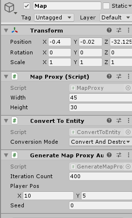

#### [« Previous: 1.1 - ECS](../1.1-ECS/README.md#11---ecs) —  [Next: 1.3 - A More Interesting Map »](../1.3-AMoreInterestingMap/README.md)

# 1.2 - Walking a Map

This chapter is focused on generating a map in ECS for the player to move around in. It also displays controls at runtime to control the map size, and uses Unity's new input system to read input.

## Representing the Map - aka Shared Data

For this example the map data is defined simply as a [DynamicBuffer](https://docs.unity3d.com/Packages/com.unity.entities@0.5/api/Unity.Entities.DynamicBuffer-1.html?q=DynamicBuffer) of `TileType`:


###### TileType.cs
```
public enum TileType : int
{
    Floor = 0,
    Wall = 1,
};
```

###### TileBuffer.cs
```
public struct TileBuffer : IBufferElementData
{
    public TileType value;
    public static implicit operator TileType(TileBuffer b) => b.value;
    public static implicit operator TileBuffer(TileType v) => new TileBuffer { value = v };
}
```

Defining it this way lets us easily query and read from/write to the map inside different systems without having to manually manage job dependencies. 

When creating some common shared data like a world map, you might be tempted to create a custom data structure or self-contained class to represent your data. It's very important to consider how you intend to use your data, and how it's going to be accessed. If you intend to use that data inside a job and between systems, you would then have to [manually manage your job dependencies](https://docs.unity3d.com/2019.3/Documentation/Manual/JobSystemJobDependencies.html). 

In some cases doing that might make sense, but I've found it's a *huge* pain and not even remotely worth the trouble in most cases. It tends to make your system code much harder to parse and is horribly annoying to maintain when you need to make changes. 

Basically if you have some data **that will be shared between systems** and you can get away with representing your data as an `IComponentData` or a `DynamicBuffer`, you should do so. This will let you benefit from the inherent speed and data-separation that comes from ECS while not having to worry about the dependency-management headache. By defining your data inside components you can let Unity handle all dependency management for you and only focus on your logic.

The TileBuffer alone can't entirely represent our map though. We also use a `MapData` component to hold the map dimensions size:

###### MapProxy.cs
```
public struct MapData : IComponentData
{
    public int width;
    public int height;
}
```

So we can then represent our map as an Entity with a `MapData` component and a `TileBuffer`, to be queried in other systems. We create the initial empty map via a simple conversion script:

###### MapProxy.cs
```
    public class MapProxy : MonoBehaviour, IConvertGameObjectToEntity
    {
        [SerializeField]
        int _width = 80;
        [SerializeField]
        int _height = 50;
        
        public void Convert(Entity entity, EntityManager dstManager, GameObjectConversionSystem conversionSystem)
        {
            dstManager.AddComponentData(entity, new MapData
            {
                width = _width,
                height = _height,
            });

            var buffer = dstManager.AddBuffer<TileBuffer>(entity);

        }
    }
```

This gives us a simple component we can add to a gameobject. We can then tweak the size of the map through the inspector and it will be generated at runtime via the [Conversion System](https://docs.unity3d.com/Packages/com.unity.entities@0.5/manual/gp_overview.html#authoring-overview).

## Map Generation

That gives us a map entity, but it needs to be initialized somehow. For that we have the `GenerateMapProxy` MonoBehaviour:

###### GenerateMapProxy.cs
```
[GenerateAuthoringComponent]
public struct GenerateMap : IComponentData
{
    public int iterationCount;
    public int2 playerPos;
    public int seed;
}
```

This uses the useful `[GenerateAuthoringComponent]` attribute. This will automatically generate an `IConvertGameObjectToEntity` MonoBehaviour from our `IComponentData`. Since we don't require any special logic for this particular component, we can just let Unity generate the Converter for us so we can easily tweak the values in the inspector:



The actual map generation happens in `GenerateMapSystem`. The process is fairly straightforward - first we gather the relevant map and generation data from our map entity:

###### [GenerateMapSystem.cs](Map/GenerateMapSystem.cs)
```
protected override void OnUpdate()
{
    ...

    var mapEntity = _generateMapQuery.GetSingletonEntity();
    var genData = EntityManager.GetComponentData<GenerateMap>(mapEntity);
    var mapData = EntityManager.GetComponentData<MapData>(mapEntity);
    var map = EntityManager.GetBuffer<TileBuffer>(mapEntity);
    ...
}
```

Then pass it into our job for the actual generation:

###### [GenerateMapSystem.cs](Map/GenerateMapSystem.cs)
```
inputDeps = Job.WithCode(() =>
{
    int w = mapData.width;
    int h = mapData.height;

    InitializeMap(map, w, h);

    BuildBorder(map, w, h);

    genData.seed = genData.seed == 0 ? randomSeed : genData.seed;
    GenerateWalls(map, w, h, genData);

}).Schedule(inputDeps);
```

We use static methods inside the `GenerateMapSystem` class to make things a bit more readable. It's okay to use static methods in jobs as long as they aren't touching any outside mutable or managed data.

`InitializeMap` is self-explanatory. Inside `BuildBorder` we set all the border tiles to walls:
```
[MethodImpl(MethodImplOptions.AggressiveInlining)]
static int At(int x, int y, int width) => y * width + x;

static void BuildBorder(DynamicBuffer<TileBuffer> map, int w, int h)
{
    for (int x = 0; x < w; ++x)
    {
        map[At(x, 0, w)] = TileType.Wall;
        map[At(x, h - 1, w)] = TileType.Wall;
    }

    for (int y = 0; y < h; ++y)
    {
        map[At(0, y, w)] = TileType.Wall;
        map[At(w - 1, y, w)] = TileType.Wall;
    }
}
```

In `GenerateWalls` we just do a big loop and randomly set tiles to walls as long as they aren't at the player position:
```
static void GenerateWalls(DynamicBuffer<TileBuffer> map, int w, int h, GenerateMap genData )
{
    Random rand = new Random((uint)genData.seed);
    for (int i = 0; i < genData.iterationCount; ++i)
    {
        int x = rand.NextInt(1, w - 2);
        int y = rand.NextInt(1, h - 2);

        if (x == genData.playerPos.x && y == genData.playerPos.y)
            continue;
                
        map[At(x,y,w)] = TileType.Wall;
    }
}
```

"Random" in this case refers to Unity's job-safe [Random struct](https://docs.unity3d.com/Packages/com.unity.mathematics@1.1/api/Unity.Mathematics.Random.html?q=Random) from their DOTs Mathematics package.

The remainder of `OnUpdate` simply sets the player's position in a standard `ForEach` and queues the `GenerateMap` component for removal.:

```
inputDeps = Entities
    .WithAll<Player>()
    .ForEach((ref Position pos) =>
    {
        var p = genData.playerPos;
        pos = p;
    }).Schedule(inputDeps);
            
commandBuffer.RemoveComponent<GenerateMap>(_generateMapQuery);
_barrier.AddJobHandleForProducer(inputDeps);
```

When we want to generate a new map, we simply add a new `GenerateMap` component to the map and it runs through this whole process again. You can see an example of this inside the  `MapSizeControls` MonoBehaviour:

###### [MapSizeControls.cs](UI/MapSizeControls.cs)
```
var em = World.DefaultGameObjectInjectionWorld.EntityManager;
var gen = new GenerateMap
{
    iterationCount = (int)_iterationsSlider.value,
    playerPos = new int2(
        UnityEngine.Random.Range(1, size.x - 1),
        UnityEngine.Random.Range(1, size.y - 1)),
    seed = UnityEngine.Random.Range(1, int.MaxValue)
};
em.AddComponentData(_mapEntity, gen);
```

#### [« Previous: 1.1 - ECS](../1.1-ECS/README.md#11---ecs) —  [Next: 1.3 - A More Interesting Map »](../1.3-AMoreInterestingMap/README.md)