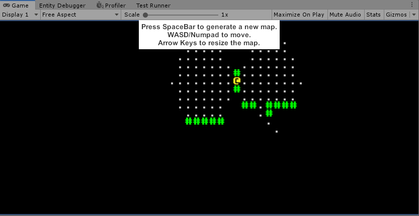
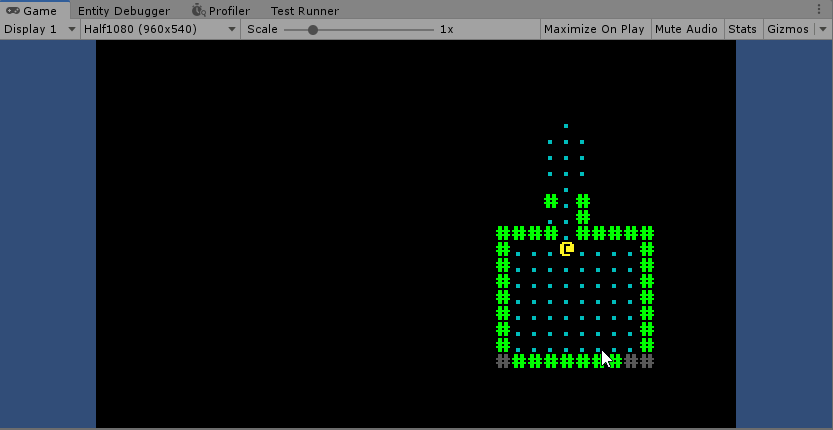

#### [« Previous: 1.3 - A More Interesting Map](../1.3-AMoreInterestingMap/README.md) —  [Next: 1.5 - Monsters and Refactoring » ](../1.5-Monsters/README.md)

--------

# 1.4 - Field of View, Interfaces, and Reactive Systems

This chapter covers the implementation of a "Field of View" and "Memory" system. It uses [RLTK's FOV algorithm](https://github.com/sarkahn/rltk_unity/tree/master/Assets/Runtime/RLTK/FieldOfView) to calculate visible points on the map. We also go over how to properly use interfaces to allow for 'function pointer-like' behaviour in Burst/Jobs and briefly cover "Reactive Systems" in ECS. 

## The Data

The `TilesInView` buffer represents the tiles that are currently visible to a given entity. 

###### [FOV/TilesInView.cs](FOV/TilesInView.cs)
```
    public struct TilesInView : IBufferElementData
    {
        public int2 value;
        public static implicit operator int2(TilesInView c) => c.value;
        public static implicit operator TilesInView(int2 v) => new TilesInView { value = v };
    }
```

`FOVRange` is how far the entity can see:
###### [FOV/FOVRange.cs](FOV/FOVRange.cs)
```
    public struct FOVRange : IComponentData
    {
        public int value;
        public static implicit operator int(FOVRange c) => c.value;
        public static implicit operator FOVRange(int v) => new FOVRange { value = v };
        public static FOVRange Default => 8;
    }
```

Inside `FOVSystem` we read from the map and use our FOV components to calculate our visible points. First step is to gather the necessary data to pass into the job:

###### [FOV/FOVSystem.cs](FOV/FOVSystem.cs)
```
protected override JobHandle OnUpdate(JobHandle inputDeps)
{
    var mapEntity = _mapQuery.GetSingletonEntity();
    var map = EntityManager.GetBuffer<MapTiles>(mapEntity);
    var mapData = EntityManager.GetComponentData<MapData>(mapEntity);

    var fovEntity = _FOVQuery.GetSingletonEntity();

    int2 origin = EntityManager.GetComponentData<Position>(fovEntity);
    int range = EntityManager.GetComponentData<FOVRange>(fovEntity);
    DynamicBuffer<TilesInView> fovTiles = EntityManager.GetBuffer<TilesInView>(fovEntity);

    var visibilityMap = new VisibilityMap(
        mapData.width, mapData.height, 
        map.Reinterpret<TileType>().AsNativeArray(), 
        Allocator.TempJob);

    ...
}
```

Most of that should be pretty straightforward if you're comfortable with ECS - we gather all the components and buffers we're going to need via entity queries to pass into our job. The unusual part is the `VisibilityMap`. There's a lot to explain there, and we will momentarily. But for now we're going to quickly go over the rest of `FOVSystem.OnUpdate`.

###### [FOV/FOVSystem.cs](FOV/FOVSystem.cs)
```
    inputDeps = Job.WithCode(() =>
    {
        FOV.Compute(origin, range, visibilityMap);

        fovTiles.Clear();

        var visibleTiles = visibilityMap.visibleTiles;

        for (int i = 0; i < visibleTiles.Length; ++i)
            fovTiles.Add(visibleTiles[i]);
    }).Schedule(inputDeps);
```

We pass in the relevant data that we just retrieved to RLTK's FOV algorithm, clear our fovTiles buffer and rebuild it based on our results. This gives us a nice list of visible tiles for use in other systems.

## Visibility Map

Now back to our `VisibilityMap` constructor inside `FOVSystem`:

###### [FOV/FOVSystem.cs](FOV/FOVSystem.cs)
```
    var visibilityMap = new VisibilityMap(
        mapData.width, mapData.height, 
        map.Reinterpret<TileType>().AsNativeArray(), 
        Allocator.TempJob);
```

`VisibilityMap` is what we're using to represent our map data for use with RLTK's FOV algorithm. If you're not familiar with ECS, the second argument where we pass in our map data might be a little confusing.

The most important thing to note is that there is no copying going on here - we are using `DynamicBuffer`'s [reinterpret](https://docs.unity3d.com/Packages/com.unity.entities@0.5/manual/dynamic_buffers.html?q=Reinterpret#using-an-entitycommandbufferxrefunityentitiesentitycommandbuffer) to represent our buffer as it's underlying type (TileType) then using [AsNativeArray()](https://docs.unity3d.com/Packages/com.unity.entities@0.5/api/Unity.Entities.DynamicBuffer-1.html?q=AsNativeArray#Unity_Entities_DynamicBuffer_1_AsNativeArray) to pass a `NativeArray` that aliases the original data. Because the array aliases the original data, any changes to it will be reflected in the Dynamic Buffer.

Because we took the time to properly represent our map data in a simple and generic way inside an entity, we can now reap the benefits - we can pass our data around without worrying about copying or dependencies and it can be handled by our FOV algorithm as nothing more than a basic array,  as that's what it is under the hood - a simple array of enums.

Now I've explained what the `VisibilityMap` is being used for, I want to explain how exactly it interfaces with RLTK - it's important. 

The `VisiblityMap` struct is defined like this:

###### [FOV/VisibilityMap.cs](FOV/VisibilityMap.cs)
```
    public struct VisibilityMap : IVisibilityMap, IDisposable
    {
        public int width;
        public int height;
        
        NativeArray<TileType> tiles;
        public NativeList<int2> visibleTiles;

        public VisibilityMap(int width, int height, NativeArray<TileType> mapTiles, Allocator allocator)
        {
            this.tiles = mapTiles;
            this.width = width;
            this.height = height;
            this.visibleTiles = new NativeList<int2>(width * height / 2, allocator);
        }

        public float Distance(int2 a, int2 b) => math.distance(a, b);

        public bool IsInBounds(int2 p) => p.x >= 0 && p.x < width && p.y >= 0 && p.y < height;

        public bool IsOpaque(int2 p)
        {
            if (IsInBounds(p) == false)
                return true;
            return tiles[p.y * width + p.x] == TileType.Wall;
        }

        public void SetVisible(int2 p)
        {
            if (!IsInBounds(p))
                return;
            visibleTiles.Add(p);
        }
    }
```

You can see it's very straightforward - it accepts our map data and the functions just operate on the data as you'd expect. Note that it also derives from the interface `IVisiblityMap`. This is an interface provided by RLTK:

###### RLTK/Runtime/RLTK/FieldOfView/IVisibilityMap.cs
```
    public interface IVisibilityMap
    {
        bool IsOpaque(int2 p);
        bool IsInBounds(int2 p);
        void SetVisible(int2 p);
        float Distance(int2 a, int2 b);
    }
```

To re-iterate - this interface is not present in the project, it's a part of the RLTK package. This lets us define the relevant map data however we want in our game, then we can pass it in to RLTK's field of view algorithm and it will use the interface implementation to get the visible points.


## Interfaces in Jobs and Burst

Back in `OnUpdate` there was a single line that called in to RLTK's FOV algorithm inside a Bursted `Foreach` job: 

`FOV.Compute(origin, range, visibilityMap);`

Though it's not obvious from this code, `FOV.Compute` is a generic function which accepts an `IVisibilityMap` interface as a generic parameter:

```
static public void Compute<T>(int2 origin, int range, T map) where T : IVisibilityMap
```

If you're familiar with the restrictions of Burst you might think this function couldn't be called in Burst or in a job since it relies on inheritance. While it's true that normally you can't use any kind of inheritance or polymorphism in Burst or Jobs, you can kind of "trick it" using a generic parameter with an interface type constraint like `Compute` is doing. The generic parameter will be compiled to a concrete struct at compile time and the resulting code will never know the difference. 

This technique is incredibly useful for creating a "function pointer" like API in Burst , which is absolutely essential for making more flexible and readable code.

I should also note that while Burst does technically have a separate [FunctionPointer](https://docs.unity3d.com/Packages/com.unity.burst@1.2/manual/index.html#function-pointers) type, I would strongly recommend against using it. It is *extremely* restrictive on what functions it accepts (only static functions, no lambdas without resorting to "unsafe" code) and in my opinion it forces you to write very ugly code to make it work.

## Rendering

Now we've covered interfaces we can get back to the actual example. With our `TilesInView` buffer populated we can change the renderer to draw based on those tiles:

###### [Rendering/RenderSystem.cs](Rendering/RenderSystem.cs)
```
    var mapEntity = _mapQuery.GetSingletonEntity();
    var mapData = _mapQuery.GetSingleton<MapData>();

    var fovEntity = _fovQuery.GetSingletonEntity();
    var fovTiles = EntityManager.GetBuffer<TilesInView>(fovEntity).AsNativeArray();
            
    if(mapData.width != _console.Width || mapData.height != _console.Height)
    {
        _console.Resize(mapData.width, mapData.height);
        RenderUtility.AdjustCameraToConsole(_console);
        return inputDeps;
    }
            
    _console.ClearScreen();


    Job.WithoutBurst().WithCode(() =>
    {
        for( int i = 0; i < fovTiles.Length; ++i )
        {
            var p = fovTiles[i].value;
            int idx = p.y * mapData.width + p.x;
                    
            switch ((TileType)map[idx])
            {
                case TileType.Floor:
                    _console.Set(p.x, p.y, new Color(0, 0.5f, 0.5f), Color.black, ToCP437('.'));
                    break;
                case TileType.Wall:
                    _console.Set(p.x, p.y, new Color(0, 1, 0), Color.black, ToCP437('#'));
                    break;
            }
        }
    }).Run();
    ...

```

Extremely straightforward - we iterate the visible tiles and draw only what we can see. This alone gives us a nice FOV:



We can improve on it though. We want to be able to remember the previous tiles we've seen, a typical feature in many roguelikes. Thankfully it's extremely simple since all the data we would need is already represented in easy to retrieve components.

## Memory

We just need to add a new "Memory" buffer to our player:

###### [FOV/TilesInMemory.cs](FOV/TilesInMemory.cs)
```
    public struct TilesInMemory : IBufferElementData
    {
        public bool value;
        public static implicit operator bool(TilesInMemory c) => c.value;
        public static implicit operator TilesInMemory(bool v) => new TilesInMemory { value = v };
    }
```

This buffer gets added with the everything else back in [PlayerProxy](Player/PlayerProxy.cs). Once it's on our player we need to initialize it properly somewhere. We create one system to intialize it and one to update it when needed. First, initialization:

###### [FOV/InitializeTilesInMemorySystem.cs](FOV/InitializeTilesInMemorySystem.cs)
```
        EntityQuery _mapQuery;
        EntityQuery _memoryQuery;

        protected override void OnCreate()
        {
            _mapQuery = GetEntityQuery(
                ComponentType.ReadOnly<GenerateMap>(),
                ComponentType.ReadOnly<MapData>()
                );

            _memoryQuery = GetEntityQuery(
                ComponentType.ReadWrite<TilesInMemory>()
                );

            RequireForUpdate(_mapQuery);
            RequireForUpdate(_memoryQuery);
        }

        protected override JobHandle OnUpdate(JobHandle inputDeps)
        {
            var mapEntity = _mapQuery.GetSingletonEntity();
            var mapData = EntityManager.GetComponentData<MapData>(mapEntity);

            var memoryEntity = _memoryQuery.GetSingletonEntity();
            var memory = EntityManager.GetBuffer<TilesInMemory>(memoryEntity);

            inputDeps = Job.WithCode(() =>
            {
                memory.ResizeUninitialized(mapData.width * mapData.height);
                for (int i = 0; i < memory.Length; ++i)
                    memory[i] = false;
            }).Schedule(inputDeps);

            return inputDeps;
        }
```

Nothing too crazy, we just resize the buffer to match the size of our map. Of note is the `_mapQuery` we create in `OnCreate` - it depends on `GenerateMap`:

[FOV/InitializeTilesInMemorySystem.cs](FOV/InitializeTilesInMemorySystem.cs)
```
    _mapQuery = GetEntityQuery(
        ComponentType.ReadOnly<GenerateMap>(),
        ComponentType.ReadOnly<MapData>()
        );
```

## Reactive Systems
Even though we don't *use* `GenerateMap` here, we can still create our query to depend on it, meaning the query will only return a map entity if it has the `GenerateMap` component attached to it.

You may recall from the previous chapters that `GenerateMap` is a component that's only added to the map entity for a single frame. It's created, immediately processed to generate the map, then destroyed. This is a fairly common "event" pattern in ECS, and by no coincidence we can rely on this behaviour to intialize our map-dependent data whenever the map gets regenerated. Then once the `GenerateMap` component is destroyed at the end of the frame, this system will no longer run. 

Systems that respond to "event" components and entities like this are called "Reactive Systems" and in my opinion should be considered the canonical way to handle "events" in ECS. They allow you to avoid coupling your systems to one another while making it obvious what's going on and they are inherently efficient since they only run when the thing they're concerned with actually exists. 

If you ever find yourself sending "messages" between systems, writing "dirty" flags on your components or calling directly into one system from inside another system, you should stop and ask yourself if the situation couldn't be handled better via a reactive system. While it does involve writing more boilerplate, the headache it saves from not coupling your systems directly to one another is usually more than worth the extra work I've found.

One final note on the subject - there are valid performance concerns for this pattern in some cases. Structural changes (like creating and destroying components or entities) are not free since they cause Unity to make changes to the underlying chunks that hold our data. There have been massive performance improvements on this front since the early days of Unity ECS - since we can now use EntityCommandBuffers inside bursted code, **in most cases the cost of simple structural changes should be of minimal concern when weighed against the benefit making your code readable and flexible**. However if it's something you're doing literally every frame (or multiple times per frame) you should certainly profile and consider if an alternative solution might be a better fit.

## Finishing up

Moving on, with our memory initialized we can now update it in a separate system:

###### [FOV/UpdateTilesInMemorySystem.cs](FOV/UpdateTilesInMemorySystem.cs)
```
    var memoryEntity = _memoryQuery.GetSingletonEntity();
    var fovTiles = EntityManager.GetBuffer<TilesInView>(memoryEntity);
    var memory = EntityManager.GetBuffer<TilesInMemory>(memoryEntity);

    var mapEntity = _mapQuery.GetSingletonEntity();
    var mapData = EntityManager.GetComponentData<MapData>(mapEntity);
            
    inputDeps = Job
        .WithReadOnly(fovTiles)
        .WithCode(() =>
    {
        for( int i = 0; i < fovTiles.Length; ++i )
        {
            var p = fovTiles[i].value;
            int idx = p.y * mapData.width + p.x;
            memory[idx] = true;
        }
    }).Schedule(inputDeps);
```

Again, very straightforward. We run through any currently visible tiles and add them to our memory. The final step is to update our rendering process to account for our new memory. It's also very straightforward:

###### [Rendering/RenderSystem.cs](Rendering/RenderSystem.cs)
```
    var playerEntity = _playerQuery.GetSingletonEntity();
    var mapMemory = EntityManager.GetBuffer<TilesInMemory>(playerEntity);

    var map = EntityManager.GetBuffer<MapTiles>(mapEntity);
            
    _console.ClearScreen();

    Job.WithoutBurst().WithCode(() =>
    {
        for( int x = 0; x < mapData.width; ++x )
            for( int y = 0; y < mapData.height; ++y )
            {
                int idx = y * mapData.width + x;
                if (mapMemory[idx])
                {
                    switch ((TileType)map[idx])
                    {
                        case TileType.Floor:
                            _console.Set(x, y, new Color(0.1f, 0.1f, 0.1f), Color.black, ToCP437('.'));
                            break;
                        case TileType.Wall:
                            _console.Set(x, y, new Color(0.1f, .1f, 0.1f), Color.black, ToCP437('#'));
                            break;
                    }
                }
            }
    }).Run();

    Job.WithoutBurst().WithCode(() =>
    {
        for( int i = 0; i < fovTiles.Length; ++i )
        {
            var p = fovTiles[i].value;
            int idx = p.y * mapData.width + p.x;
                    
            switch ((TileType)map[idx])
            {
                case TileType.Floor:
                    _console.Set(p.x, p.y, new Color(0, 0.5f, 0.5f), Color.black, ToCP437('.'));
                    break;
                case TileType.Wall:
                    _console.Set(p.x, p.y, new Color(0, 1, 0), Color.black, ToCP437('#'));
                    break;
            }
        }
    }).Run();
```

We simply clear the console, draw the "memory" tiles first, then draw the currently visible tiles on top. There's certainly some room for performance improvements there but it serves us well enough for this example:



And that's it for this chapter. We learned how to implement a simple FOV system with "memory", briefly covered using interfaces with jobs and burst, and learned how Reactive Systems are an ideal fit for processing events in ECS. 

If you found yourself confused by any of the ECS related code you've read in this chapter, I encourage you to read over the learning material I provided in [chapter 1.1](../1.1-ECS/README.md#learning-the-basics-of-ecs).

----------------------

These tutorials will always be free and the code will always be open source. With that being said I put quite a lot of work into them. If you find them useful, please consider donating. Any amount you can spare would really help me out a great deal - thank you!

[](https://www.paypal.com/cgi-bin/webscr?cmd=_s-xclick&hosted_button_id=Y54CX7AXFKQXG)


--------

#### [« Previous: 1.3 - A More Interesting Map](../1.3-AMoreInterestingMap/README.md) —  [Next: 1.5 - Monsters and Refactoring » ](../1.5-Monsters/README.md)