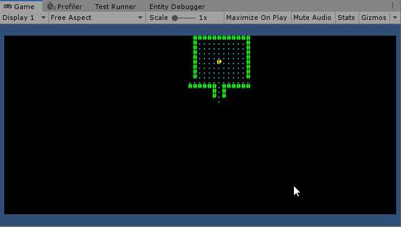
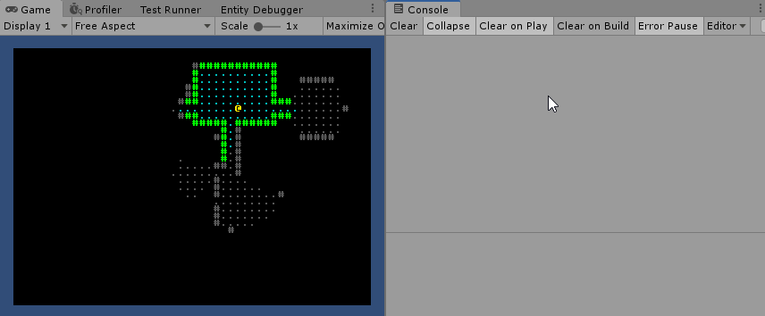

#### [« Previous: 1.4 - Field of View, Interfaces, and Reactive Systems](../1.4-FieldOfView/README.md) —  [Next: In Progress... »]

--------

# 1.5 - Monsters and Refactoring

In this chapter we're going to go over some code refactoring and then add monsters to  our map.

## Refactoring

In the last few chapters we introduced a lot of behaviour to the player - movement, field of view, as well as the ability to resize or regenerate our map. Now that we're going to introduce enemies later on in this chapter, we need to generalize some of that behaviour.

For instance - we want enemies to have a field of view too so we know when they can see the player. We also want to generalize the concept of movement so all entities can move using the same system - we don't want to have to create a separate system for every entity type.

#### Reading Input vs Reading Intents

In the previous chapters we would write all our input to the `PlayerInput` component on our player entity, then read from that component in other systems to perform actions.

Instead of reading inputs, we want to be reading actions - or intentions to act, at least. This way our systems can apply to both the player and an ai. To get there we'll first refactor the input system a bit to fit this concept. In previous chapters our input looked like this:

###### PlayerInputSystem
```
    protected override JobHandle OnUpdate(JobHandle inputDeps)
    {
        if( _quitAction.triggered )
        {
            Application.Quit();
            return inputDeps;
        }

        var inputEntity = _inputQuery.GetSingletonEntity();
        var lastInput = EntityManager.GetComponentData<PlayerInput>(inputEntity);

        float2 movement = _moveAction.triggered ? (float2)_moveAction.ReadValue<Vector2>() : float2.zero;
        bool generateMap = _generateMapAction.triggered;

        // Check it our input from last frame matches our current input. If so, avoid writing to the
        // components so we don't constantly cause the player chunk to be marked dirty.
        if(lastInput.movement.x == movement.x && lastInput.movement.y == movement.y &&
            lastInput.generateNewMap == generateMap)
            return inputDeps;

        inputDeps = Entities
            .ForEach((ref PlayerInput input) =>
        {
            input.movement = movement;
            input.generateNewMap = generateMap;
        }).Schedule(inputDeps);

        return inputDeps;
    }
```

We want to change from writing input to the player to writing intentions to act. We're going to move the "Map Input" related code to another system as well, since it doesn't really make sense to be embedding that on the player entity. 

First we get rid of `PlayerInput` and replace it with a generic `Movement` struct. It contains the same `float2` value. Instead of writing input to the player, we can read the input in `PlayerInputSystem` and immediately respond to it by writing to our `Movement` component, which essentially defines an entity's intention to move.

Once we remove all the map references and change our input component, we end up with this:

###### [Player/PlayerInputSystem.cs](Player/PlayerInputSystem.cs)
```
    protected override JobHandle OnUpdate(JobHandle inputDeps)
    {
        var moveInput = _moveAction.triggered ? (float2)_moveAction.ReadValue<Vector2>() : float2.zero;
            
        if (moveInput.x == _previousMove.x && moveInput.y == _previousMove.y)
            return inputDeps;
        _previousMove = moveInput;

        inputDeps = Entities
            .WithAll<Player>()
            .ForEach((ref Movement move) =>
            {
                move = (int2)moveInput;
            }).Schedule(inputDeps);
            
        return inputDeps;
    }
```

Just like before, we track our previous inputs to prevent writing constantly to our movement component.

Now we need to respond to this movement. Refactoring the old `PlayerMoveSystem` to a more generic `MoveSystem` is pretty straightforward:

###### [Common/MoveSystem.cs](Common/MoveSystem.cs)
```
    public class MoveSystem : JobComponentSystem
    {
        EntityQuery _mapQuery;
        EntityQuery _moveQuery;
        
        protected override void OnCreate()
        {
            _mapQuery = GetEntityQuery(
                ComponentType.ReadWrite<MapTiles>(),
                ComponentType.ReadOnly<MapData>()
                );

            _moveQuery = GetEntityQuery(
                ComponentType.ReadWrite<Position>(),
                ComponentType.ReadOnly<Movement>()
                );
            
            _moveQuery.AddChangedVersionFilter(typeof(Movement));
        }

        protected override JobHandle OnUpdate(JobHandle inputDeps)
        {
            if (_moveQuery.CalculateEntityCount() == 0)
                return inputDeps;

            var mapEntity = _mapQuery.GetSingletonEntity();
            var map = EntityManager.GetBuffer<MapTiles>(mapEntity);
            var mapData = EntityManager.GetComponentData<MapData>(mapEntity);

            inputDeps = Entities
                .WithReadOnly(map)
                .ForEach((ref Position p, ref Movement move) =>
            {
                int2 dest = p.value + move.value;
                int index = dest.y * mapData.width + dest.x;

                move = int2.zero;

                if (index < 0 || index >= map.Length)
                    return;

                if( map[index] != TileType.Wall )
                {
                    p = dest;
                }
            }).Schedule(inputDeps);

            return inputDeps;
        }
    }
```

We perform the same logic to see if it's a valid move, but now we're querying for the `Movement` components. Any entity can now have the ability to move with a `Position` and `Movement` component.

#### Field of View Changes

We also want to apply field of view to more entities - when reviewing the FOV classes I came to the conclusion that we could stand to clean the file structure up a bit while we're at it. 

In general if two systems are operating on the exact same sets of components it can make sense to combine them into one system. In our case we want to combine the "InitializeTiles" and "UpdateTiles" systems into one, like so:

###### [Visibility/VisibilitySystem.cs](Visibility/VisibilitySystem.cs)
```
    protected override JobHandle OnUpdate(JobHandle inputDeps)
    {
        var mapEntity = _mapQuery.GetSingletonEntity();
        var map = EntityManager.GetBuffer<MapTiles>(mapEntity);
        var mapData = EntityManager.GetComponentData<MapData>(mapEntity);

        if (map.Length == 0 )
            return inputDeps;

        inputDeps = ProcessViewMemoryEntities(mapEntity, map, mapData, inputDeps);

        inputDeps = ProcessViewEntities(map, mapData, inputDeps);
            
        return inputDeps;
    }
```

We now have two static functions that perform the FOV algorithm for two different types of entities - entities with a view and memory (the player) and entities with only a view (monsters). 

###### [Visibility/VisibilitySystem.cs](Visibility/VisibilitySystem.cs)
```
        JobHandle ProcessViewMemoryEntities(bool mapRegenerated, DynamicBuffer<MapTiles> map, MapData mapData, JobHandle inputDeps)
        {
            // Process Entities with both a view and a memory
            return Entities
                .WithChangeFilter<Position>()
                .WithReadOnly(map)
                .ForEach((ref DynamicBuffer<TilesInView> view, ref DynamicBuffer<TilesInMemory> memory,
                in Position pos, in ViewRange range) =>
                {

                    if (memory.Length != map.Length || mapRegenerated)
                    {
                        memory.ResizeUninitialized(map.Length);
                        for (int i = 0; i < memory.Length; ++i)
                            memory[i] = false;
                    }
                    

                    if (view.Length != map.Length || mapRegenerated)
                        view.ResizeUninitialized(map.Length);

                    // Always reset view before rebuilding
                    for (int i = 0; i < view.Length; ++i)
                        view[i] = false;

                    var visibility = new VisibilityMap(
                        mapData.width, mapData.height,
                        map.Reinterpret<TileType>().AsNativeArray(),
                        view.Reinterpret<bool>().AsNativeArray(),
                        memory.Reinterpret<bool>().AsNativeArray()
                        );

                    FOV.Compute(pos, range, visibility);
                }).Schedule(inputDeps);
        }
```

Instead of having a dedicated system for initializing the buffer, we just check if it needs to be resized any time it gets regenerated (whenever position changes), and then run the same FOV check as before. The big difference now is in the `VisibilityMap`. Previously the `VisibilityMap` struct would maintain an internal list of tiles found during the FOV check, which we would iterate over after the FOV call in order to build our visible tiles and memory. Now we just pass in all the relevant arrays to be used directly during the FOV algorithm:

###### [Visibility/VisibilityMap.cs](Visibility/VisibilityMap.cs)
```
    public struct VisibilityMap : IVisibilityMap
    {
        public int width;
        public int height;
        
        NativeArray<TileType> tiles;

        NativeArray<bool> view;
        NativeArray<bool> memory;
        
        public float Distance(int2 a, int2 b) => math.distance(a, b);

        public bool IsInBounds(int2 p) => p.x >= 0 && p.x < width && p.y >= 0 && p.y < height;

        public bool IsOpaque(int2 p)
        {
            if (IsInBounds(p) == false)
                return true;
            return tiles[p.y * width + p.x] == TileType.Wall;
        }

        public void SetVisible(int2 p)
        {
            if (!IsInBounds(p))
                return;
            int i = p.y * width + p.x;
            view[i] = true;

            if( memory.IsCreated )
                memory[i] = true;
        }

        public VisibilityMap(int width, int height, 
            NativeArray<TileType> map, 
            NativeArray<bool> view,
            NativeArray<bool> memory = default)
        {
            this.tiles = map;
            this.width = width;
            this.height = height;
            this.view = view;
            this.memory = memory;
        }
    }
```

We're using the exact same `IVisibilityMap` interface from the previous chapter, we've just changed how the `VisibilityMap` works internally. You can see in `SetVisible` we allow the FOV algorithm to make direct changes to our entity's view and memory.

Back in the `VisibilitySystem` we call `ProcessViewEntities` for entities with a view but with no memory. The `VisibilityMap` was designed with this in mind, so it's pretty much identical to the first function except we don't pass in the memory buffer to the `VisibilityMap`.

#### Generalizing Entity Rendering

Finally we need to change the rendering system a bit to handle rendering more than just the player entity. For this we create a `Renderable` component:

###### [Rendering/Renderable.cs](Rendering/RenderableAuthoring.cs)
```
public struct Renderable : IComponentData
{
    public byte glyph;
    public Color fgColor;
    public Color bgColor;

    public Renderable( char c, Color fg = default, Color bg = default )
    {
        fgColor = fg == default ? Color.white : fg;
        bgColor = bg == default ? Color.black : bg;
        glyph = RLTK.CodePage437.ToCP437(c);
    }
}

public class RenderableAuthoring : MonoBehaviour, IConvertGameObjectToEntity
{
    public char _glyph;
    public Color _fgColor = Color.white;
    public Color _bgColor = Color.black;

    public void Convert(Entity entity, EntityManager dstManager, GameObjectConversionSystem conversionSystem)
    {
        dstManager.AddComponentData(entity, new Renderable
        {
            glyph = RLTK.CodePage437.ToCP437(_glyph),
            fgColor = _fgColor,
            bgColor = _bgColor,
        });
    }
}
```

While we're mostly going to be creating entities through code, we can also use this component on the player's GameObject to change it's appearance in the inspector.


The `RenderSystem` also needs to be changed to render any `Renderable` instead of just the player:

###### [Rendering/RenderSystem.cs](Rendering/RenderSystem.cs)
```
protected override JobHandle OnUpdate(JobHandle inputDeps)
{
    ...

    Entities
        .WithoutBurst()
        .ForEach((in Renderable render, in Position pos) =>
        {
            int2 p = math.clamp(pos, 1, mapData.Size - 1);
            if( view[p.y * mapData.width + p.x] )
                _console.Set(p.x, p.y, render.fgColor, render.bgColor, render.glyph);
        }).Run();

    _console.Update();
    _console.Draw();

    return default;
}
```

#### Refactoring Summary

During this refactoring pass we reworked the movement, view, and rendering systems so they would work on multiple entities, not just the player. Aside from those changes I also renamed the "Proxy" components to "Authoring" components, which is more inline with how Unity names entity conversion scripts. As a game evolves these types of refactoring passes are essential to keep yourself on the right track and to keep your code maintainable.

## Creating the Monsters

With refactoring covered we can get on to the real changes. First, we want to create some monsters during map generation. The first step is to define the [EntityArchetype](https://docs.unity3d.com/Packages/com.unity.entities@0.5/api/Unity.Entities.EntityArchetype.html) for our monsters - this is the set of components that we want our entity to spawn with. Back in `GenerateMapSystem` we can create our archetype inside `OnCreate`:

###### [Map/GenerateMapSystem.cs](Map/GenerateMapSystem.cs)
```
protected override void OnCreate()
{
    ...

    _monsterArchetype = EntityManager.CreateArchetype(
        ComponentType.ReadOnly<Monster>(),
        ComponentType.ReadWrite<Position>(),
        ComponentType.ReadWrite<Renderable>(),
        ComponentType.ReadWrite<Name>(),
        ComponentType.ReadOnly<TilesInView>(),
        ComponentType.ReadOnly<ViewRange>()
        );
}
```

Notice that we include the renderable, "vision" (`TilesInView`) and movement components. Since we changed our systems earlier to apply to any entities with these components, they will "just work" for our newly created monsters.

The only new components here are `Name` and `Monster`. `Monster` is just an empty tag component. `Name` is what you'd expect:

###### [Common/Name.cs](Common/Name.cs)
```
public struct Name : IComponentData
{
    public FixedString32 value;
    public static implicit operator FixedString32(Name c) => c.value;
    public static implicit operator Name(FixedString32 v) => new Name { value = v };
    public override string ToString() => value.ToString();
}
```

Late inside `OnUpdate` in `GenerateMapSystem`, after we've placed the player inside a room, we can handle our monster spawning. We first clear out any existing monsters then place a single monster in the remaining rooms. There's a 50% chance of getting a goblin or an orc:


###### [Map/GenerateMapSystem.cs](Map/GenerateMapSystem.cs)
```
protected override JobHandle OnUpdate(JobHandle inputDeps)
{
    ...

    // Destroy existing monsters
    inputDeps = Entities
        .WithNone<Player>()
        .WithAll<Renderable>()
        .WithAll<Position>()
        .ForEach((int entityInQueryIndex, Entity e) =>
        {
            conCommandBuffer.DestroyEntity(entityInQueryIndex, e);
        }).Schedule(inputDeps);


    FixedString32 goblinName = new FixedString32("Goblin");
    FixedString32 orcName = new FixedString32("Orc");

    var arch = _monsterArchetype;
    // Make monsters
    inputDeps = Job.WithCode(() =>
    {
        Random rand = new Random(seed);

        for ( int i = 1; i < rooms.Length; ++i )
        {
            var room = rooms[i];
            var monster = commandBuffer.CreateEntity(arch);

            bool flip = rand.NextBool();

            FixedString32 name = default;
            char c = default;

            if( flip )
            {
                c = 'g';
                name = goblinName;
            }
            else
            {
                c = 'o';
                name = orcName;
            }
            commandBuffer.SetComponent(
                monster,
                new Renderable( c, Color.red )
                );
            commandBuffer.SetComponent<Position>(monster, room.Center);
            commandBuffer.SetComponent<ViewRange>(monster, 5);
            commandBuffer.SetComponent<Name>(monster, name);
        }
    }).Schedule(inputDeps);
}
``` 

With that we have our monsters on the map:



But they're not doing much yet.

## AI Behaviour

Because we gave them the proper components for it our monsters have the ability to move and see, but they have nothing controlling them yet. For now we're just going to make it so that if an enemy sees the player they will print something to the debug log. To take care of that we implement our monster behaviour in `MonsterAISystem`:

###### [Monster/MonsterAISystem.cs](Monster/MonsterAISystem.cs)
```
protected override JobHandle OnUpdate(JobHandle inputDeps)
{
    var mapEntity = _mapQuery.GetSingletonEntity();
    var mapData = EntityManager.GetComponentData<MapData>(mapEntity);

    // Early out if the map is regenerating.
    if (EntityManager.HasComponent<GenerateMap>(mapEntity))
        return inputDeps;

    var playerEntity = _playerQuery.GetSingletonEntity();
    var playerPos = (int2)EntityManager.GetComponentData<Position>(playerEntity);
    var playerName = EntityManager.GetComponentData<Name>(playerEntity);
            
    int playerIndex = playerPos.y * mapData.width + playerPos.x;

    inputDeps = Entities
        .WithoutBurst()
        .WithAll<Monster>()
        .ForEach((in DynamicBuffer<TilesInView> view, in Name name) =>
        {
            if(view[playerIndex] )
            {
                Debug.Log($"{name} shouts angrily at {playerName}");
            }
        }).Schedule(inputDeps);


    return inputDeps;
}
```

Thanks to our simple data representation this turns out to be incredibly straightforward. We get the player's position and check if it's inside each monster's visible tiles. If so, we print to the log:



You might notice from the debug log that we end up with hundreds of ai actions just from a few seconds of running around. This is because there's no concept of turns yet - our ai systems just constantly checks for the player, and starts screaming over and over if it finds it. In the next chapter we'll take care of that by implementing a proper turn based system in ECS.

----------------------

These tutorials will always be free and the code will always be open source. With that being said I put quite a lot of work into them. If you find them useful, please consider donating. Any amount you can spare would really help me out a great deal - thank you!

[](https://www.paypal.com/cgi-bin/webscr?cmd=_s-xclick&hosted_button_id=Y54CX7AXFKQXG)


--------

#### [« Previous: 1.4 - Field of View, Interfaces, and Reactive Systems](../1.4-FieldOfView/README.md) —  [Next: In Progress... »]