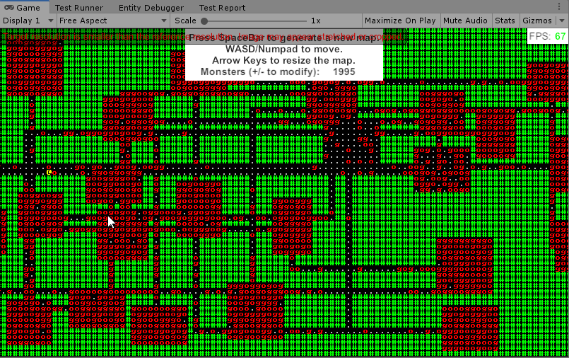

#### [« Previous: 1.5 - Monsters and Refactoring](../1.5-Monsters/README.md) — [Next: In Progress... »]

--------

# 1.5A - TakingTurns

In this chapter we'll go over my implementation of a turn-based system in ECS. There are [many ways to implement turns in a Roguelike](http://www.roguebasin.com/index.php?title=Time_Systems), this is just one way. 

## Actors

The concept is simple - all actors have energy and speed. Every frame all actors have their energy incremented by their speed, and once an actor has enough energy to act it's given the opportunity to take a turn and energy distribution stops. This is handled in `TurnBeginSystem`:

###### [TurnSystem/TurnBeginSystem.cs](TurnSystem/TurnBeginSystem.cs)
```csharp
public class TurnBeginSystem : SystemBase
{
    EntityQuery _actingActors;

    BeginSimulationEntityCommandBufferSystem _beginSimBarrier;

    protected override void OnCreate()
    {
        base.OnCreate();

        _actingActors = GetEntityQuery(
            ComponentType.ReadOnly<Actor>(),
            ComponentType.ReadOnly<TakingATurn>()
            );

        _beginSimBarrier = World.GetOrCreateSystem<BeginSimulationEntityCommandBufferSystem>();
    }

    protected override void OnUpdate()
    {
        // Don't start any new turns until all current turns are complete
        if (!_actingActors.IsEmptyIgnoreFilter)
            return;

        var buffer = _beginSimBarrier.CreateCommandBuffer().ToConcurrent();

        Entities.ForEach((Entity e, int entityInQueryIndex, ref Energy energy, in Speed speed) =>
        {
            energy += speed;
            if (energy >= Energy.ActionThreshold)
                buffer.AddComponent<TakingATurn>(entityInQueryIndex, e);
        }).ScheduleParallel();

        _beginSimBarrier.AddJobHandleForProducer(Dependency);
    }
}
```

We can see from the code above that often many actors will be getting a turn at the same time within a frame. Because of this we need to carefully consider how turns are processed. In order to avoid conflicting actions (like two actors moving into the same tile) certain actions - movement, for one - need to be processed immediately and in order so that the next actor taking a turn has up-to-date information when deciding what to do.

There's a few of important take-aways from this fact:

1. Any actions that must happen immediately (like movement) can't be separated into their own system and can't run in a multi-threaded job - they must be processed in sequence in whatever system processes actor turns. 
2. Any actions that *don't* need to happen immediately can be deferred and processed in an isolated system that schedules jobs in the regular ECS way.
3. All deferred actions must completely resolve before the next turn processing system updates, so that all game state is properly up to date for the next turn.

By relying on deferred actions wherever possible we can avoid having to define all our behaviour in the system that processes actor turns. This is an important benefit of ECS - if we attach too much behaviour to a single system then we're basically just writing [OOP god objects](https://en.wikipedia.org/wiki/God_object) and we have to pay all the costs that come along with that. With deferred actions we have to be more aware of the order our systems are updating in and when their jobs are completing in order to maintain proper game state, but it will save a headache in the long run by keeping our behaviour simple and separated.

## Processing a Turn

First we need to figure out what actions an entity is going to take during their turn. For the monsters this happens in `MonsterTurnSystem`:

###### [Monster/MonsterTurnSystem.cs](Monster/MonsterTurnSystem.cs)
```csharp
protected override void OnUpdate()
{
    var rand = _rand;

    var mapEntity = _mapQuery.GetSingletonEntity();
    var mapState = EntityManager.GetBuffer<MapState>(mapEntity);
    var mapData = EntityManager.GetComponentData<MapData>(mapEntity);

    Entities
        .WithAll<Monster>()
        .WithAll<TakingATurn>()
        .WithStoreEntityQueryInField(ref _monsterQuery)
        .ForEach((Entity e, ref Position pos, ref Energy energy) =>
        {
            // Come on man
            var r = rand[0];

            var dir = GetRandomDirection(ref r);
            rand[0] = r;

            int2 dest = pos + dir;
            int destIndex = dest.y * mapData.width + dest.x;

            if( MapUtility.CellIsUnblocked( destIndex, mapState ))
            {
                int oldIndex = MapUtility.PosToIndex(pos, mapData.width);
                pos = dest;

                MapUtility.MoveActor(e, oldIndex, destIndex, mapState);
            }

            energy -= Energy.ActionThreshold;
        }).Run();
}
```

We include the `TakingATurn` component in the ForEach query to ensure this system only runs when the entity has a turn. We also subtract our energy at the end of our turn to represent the cost of our action.

All this system does is move the monster in a random direction. We use the `MapUtility` class to check if we can move and to update the [MapState buffer](Map/MapState/UpdateMapStateSystem.cs). As you'd expect this buffer represents the current state of the map, including which tiles are pathable and what entities, if any, exist in a given cell. Since all entities are processed in sequence and we're checking the `MapState` before they move and updating it afterwards, we know there can be no possibility of any monster moving on top of another.

Later on in the frame in `LateSimulationSystemGroup` the `TurnEndSystem` will check all actors taking a turn and remove their turn if their energy falls below the threshold. This will effectively prevent entities from taking any more actions on the next frame once they've spent too much energy:

###### [TurnSystem/TurnEndSystem.cs](TurnSystem/TurnEndSystem.cs)
```csharp
protected override void OnUpdate()
{
    var buffer = _endSimBarrier.CreateCommandBuffer().ToConcurrent();

    Entities
        .WithAll<TakingATurn>()
        .WithAll<Actor>()
        .ForEach((Entity e, int entityInQueryIndex, in Energy energy) =>
        {
            if (energy < Energy.ActionThreshold)
                buffer.RemoveComponent<TakingATurn>(entityInQueryIndex, e);
        }).ScheduleParallel();

    _endSimBarrier.AddJobHandleForProducer(Dependency);
}
```

## Deferred Actions

In `MonsterTurnSystem` all the monsters do is move, which as mentioned previously is an immediate action by necessity. In `PlayerTurnSystem` we have the possibility to attack a monster. 

Unlike movement, attacks can be processed as a deferred action - the results of one actor attacking another aren't required to be known by the next actor taking their turn within the frame. If an actor gets attacked and moves during processing, it doesn't matter. If it turns out the actor dies as a result of the attack, it will  be removed by another system before rendering occurs so the player will never notice the move.

Here's how turn processing looks for the player:

###### [Player/PlayerTurnSystem.cs](Player/PlayerTurnSystem.cs)
```csharp
protected override void OnUpdate()
{
    // Input processing and gathering relevant job data
    ...

    var monsterFromEntity = GetComponentDataFromEntity<Monster>(true);

    Entities
        .WithReadOnly(monsterFromEntity)
        .WithAll<Player>()
        .WithAll<TakingATurn>()
        .ForEach((Entity e, ref Energy energy, ref Position pos) =>
        {
            int2 dest = pos + dir;
            int destIndex = dest.y * mapData.width + dest.x;

            // Don't use up an action if we don't do anything meaningful
            int cost = 0;

            if ( MapUtility.CellIsUnblocked(destIndex, mapState) )
            {
                int oldIndex = pos.value.y * mapData.width + pos.value.x;
                pos = dest;

                // Immediately update map state so the next actors have up to date state.
                MapUtility.MoveActor(e, oldIndex, destIndex, mapState);

                cost = Energy.ActionThreshold;
            }
            else
            {
                var cell = mapState[destIndex];

                if (monsterFromEntity.Exists(cell.content))
                {
                    buffer.AddComponent(e, new Attacking
                    {
                        target = cell.content
                    });

                    cost = Energy.ActionThreshold;
                }
            }

            energy -= cost;
        }).Run();
}
```

The movement code is identical to the monster's system - if we try to move and the tile is empty, we set our new position use the `MapUtility` to update map state.

If the cell is occupied however we check if it contains a monster. If it does, we then add our `Attacking` component to be processed by the `CombatSystem`:

###### [Combat/CombatSystem.cs](Combat/CombatSystem.cs)
```csharp
[UpdateBefore(typeof(DeathSystem))]
public class CombatSystem : SystemBase
{
	EntityQuery _combatQuery;

	EndSimulationEntityCommandBufferSystem _endSimBarrier;

	protected override void OnCreate()
	{
		base.OnCreate();

		_endSimBarrier = World.GetOrCreateSystem<EndSimulationEntityCommandBufferSystem>();
	}

	protected override void OnUpdate()
	{
		var healthFromEntity = GetComponentDataFromEntity<Health>(false);

		Entities
			.WithStoreEntityQueryInField(ref _combatQuery)
			.ForEach((in Attacking combat, in Strength strength) =>
			{
				healthFromEntity[combat.target] -= strength;
			}).Schedule();

		_endSimBarrier.CreateCommandBuffer().RemoveComponent<Attacking>(_combatQuery);
		_endSimBarrier.AddJobHandleForProducer(Dependency);
	}
}
```

It's fairly straightforward, we decrement the health and remove the combat component. Once we've moved away from the "processing everything in order" restriction of immediate actions we can just schedule jobs like normal. We do have to pay attention to the update order of these deferred systems though. It's important for deferred actions to be completely resolved before the next turn update, or it could cause incorrect state to be carried into the next turn. 

In this case we update all deferred systems in `LateSimulationSystemGroup` and specify the correct order via [UpdateBefore and UpdateAfter](https://docs.unity3d.com/Packages/com.unity.entities@0.7/manual/system_update_order.html). After `CombatSystem` has run the `DeathSystem` handles removing actors that have lost all their health:

###### [Combat/DeathSystem.cs](Combat/DeathSystem.cs)
```csharp
public class DeathSystem : SystemBase
{
    EndSimulationEntityCommandBufferSystem _barrier;

    protected override void OnCreate()
    {
        base.OnCreate();

        _barrier = World.GetOrCreateSystem<EndSimulationEntityCommandBufferSystem>();
    }

    protected override void OnUpdate()
    {
        var buffer = _barrier.CreateCommandBuffer().ToConcurrent();

        Entities
            .WithChangeFilter<Health>()
            .ForEach((int entityInQueryIndex, Entity e, in Health health) =>
            {
                if (health <= 0)
                {
                    buffer.DestroyEntity(entityInQueryIndex, e);
                }
            }).ScheduleParallel();

        _barrier.AddJobHandleForProducer(Dependency);
    }
} 
```

Another simple and straightforward system - it just checks health and destroys entities. This is separate from the `CombatSystem` because an entity's health could be affected by anything, and we would always want the `DeathSystem` to remove an entity with no health, regardless of how it happened.

And finally, the results:



*Carving a path through a hallway full of monsters*.

----------------------

These tutorials will always be free and the code will always be open source. With that being said I put quite a lot of work into them. If you find them useful, please consider donating. Any amount you can spare would really help me out a great deal - thank you!

[](https://www.paypal.com/cgi-bin/webscr?cmd=_s-xclick&hosted_button_id=Y54CX7AXFKQXG)


--------

#### [« Previous: 1.5 - Monsters and Refactoring](../1.5-Monsters/README.md) — [Next: In Progress... »]