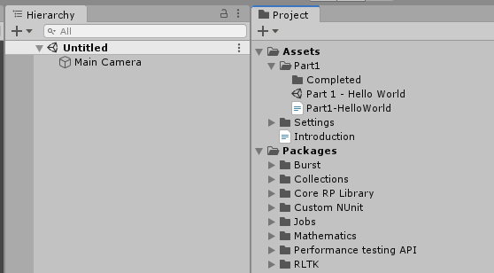
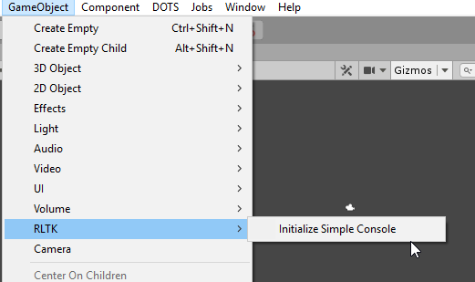
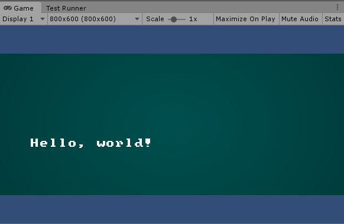
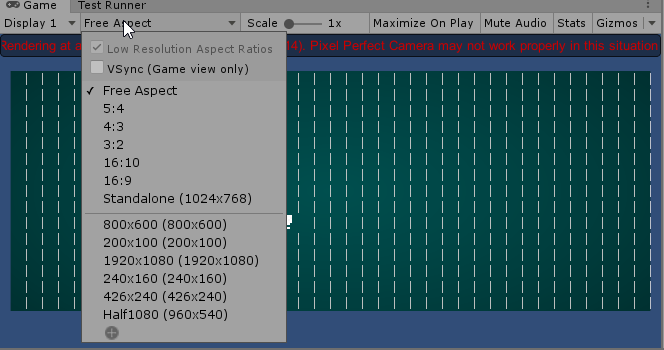
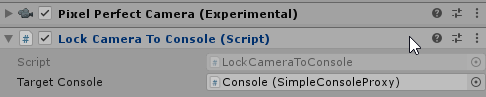
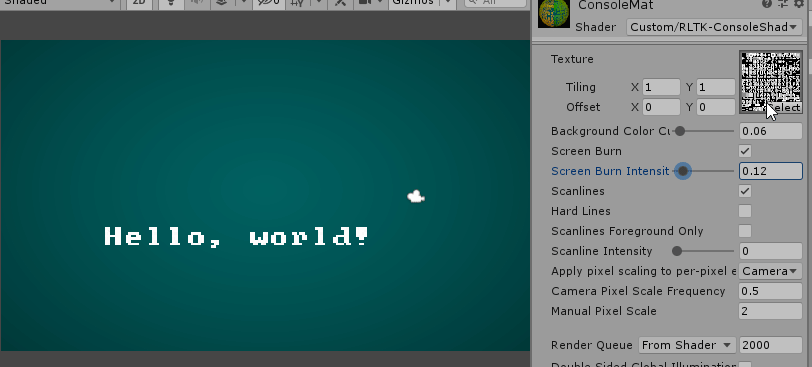

**([Back to Index](../../README.md)) - ([Previous: Introduction](../Introduction.md)) - ([Next: Part 2 - "ECS"](../Part2/Part2-ecs.md))**

# Part 1 - Hello World

Please be sure to [read the introduction](../Introduction.md) before you start. It's important.

In part 1 we're going to get our console up and running and write some text to it.

## Setting Up the Console

Assuming [everything is set up properly](../Introduction.md#what-you-need) we have 
RLTK installed and an empty scene to start work from. If you're working from 
the repository it should look similar to this:



The first thing we'll need to do is get our console in the scene. Doing 
this manually can be a little awkward, so there's a menu option under 
"GameObject/RLTK/Initialize Simple Console". That will spawn a console 
and attach the camera to it automatically:



## Writing to the Console

With our console created we can write to it from a script. Before too 
long we'll be using Unity's ECS systems to interact with our console, 
but for this example we're just going to write directly to it from a 
regular script. So create a new Script that references our console:

##### HelloWorld.cs
```
using RLTK.MonoBehaviours;
using UnityEngine;

public class HelloWorld : MonoBehaviour
{
    [SerializeField]
    SimpleConsoleProxy _console;

    private void Start()
    {
        _console.Print(5, 5, "Hello, world!");
    }
}

```

The code is pretty straightforward - we're writing the string 
"Hello, World!" to position 5,5 in the console. Make sure you're calling it
in Start and not Awake, since the console needs to do some initilization during
Awake. By default Print will write white text on a black background, but you
can call PrintColor to add colored tiles.

In order for it to work we need it to be in our scene, so attach the new 
script to any GameObject in the scene and set our console
as the reference in the inspector:


## Dealing with Visual Artifacts AKA The Camera Is Not Your Friend

Now when you press play you might see something like this:



Or, depending on what the resolution settings are in your Game View, or if you've
moved your objects around in your scene, you might see something like this:


It's important to note that as horrible as the above image looks, 
*it's completely expected*. This isn't some arcane mysterious bug with
Unity - it's an unfortunate byproduct of the way Unity renders in 2D. To
fully explain the technical details behind it is beyond the scope of this 
tutorial, but if you're curious you can google for "Pixel Perfect Unity" 
and you'll find plenty of explanations.

For our purposes though the important takeaway is that it's not 
a bug - it's just something we have to work around. We can take steps to
ensure that the actual game is presented in a way that will never
look like the picture above.

Speaking of which - as I said we're not going to get into the technical 
details, but I can explain why your game view might end up looking like 
this in your project, and how we can fix it. That garish red warning 
message gives you a nice hint:

`Rendering at an odd-numbered resolution. Pixel Perfect Camera may not work properly in this situation`

The "Pixel Perfect Camera" it's referring to is a built-in Unity component
that was put on the camera automatically from the "Initialize Simple Console"
step earlier. In order for this camera to do it's job and give us those nice
crisp pixels we so desire, it requires 3 things:
1. Our game resolution (both X and Y) needs to even. An alternative solution 
is to check the  "UpscaleRenderTexture" option in the PixelPerfectCamera component, 
but it will ONLY work if the viewport is large enough to scale up the internal RenderTexture
at least once. 
2. All objects must be positioned such that their pixels in the viewport line up with the pixel grid. By pixel grid I'm talking about the literal pixels on your monitor.
3. Our game resolution needs to be at LEAST as large as the "reference resolution" setting on the PixelPerfectCamera.

To solve the first issue in the editor you can force your game view 
into a certain resolution with this handy dropdown box:



The second issue is thankfully straightforward in our case - just keep your 
camera and console at origin (0,0,0). In future (FAR future) tutorials we may
make use of the camera for looking around, but for now we're going to rely
on the fact that our game world can be sufficiently represented on a single
console that doesn't move. 

For the third issue - if you followed the "Initialize Simple Console"
step from above then it automatically created a "LockCameraToConsole" component 
on the camera as well. 



This component will automatically set the reference resolution of 
the PixelPerfectCamera to be as large as it needs to be to show the whole 
console while not causing any visual artifacts. It works actively as you 
resize the console so you shouldn't need to worry about it as long as you're
using this component.

If you notice the camera is being a bit weird, maybe zoomed out more than it
should be, this is why. And again, it's important to remember that this is 
required in order to keep things rendering correctly, it's not something you 
can just disable and expect everthing to look okay. If your camera ends up
being too zoomed out the correct solution in our case is to resize your console so
the camera can adjust itself accordingly.

## Tweaking The Console Appearance

You may have noticed the green background on the console. That's the "Screen Burn" effect
being applied by the console's Material. You can tweak the settings on the Material to change
how the console is rendered - but by default all newly created consoles share the same material.
Because Materials are assets that live outside the scene, this means if you changed the default 
material in one scene, it would change the appearance of all other consoles in all other scenes 
in the project. Obviously not what we want!

Instead if you want to customize your console's appearance you should create a new material
and set your console use that instead by setting it in the MeshRenderer's material. Go ahead and 
create a new Material in the Part1 folder and set it's shader to "Custom/RLKT-ConsoleShader":


Then in your console's inspector you can set it to use your newly created material:


Once that's set you can tweak the values of the newly created material in it's inspector to 
change how your console is rendered:



And that will wrap up the first part. We learned how to create a console, write to it, how to make 
sure it renders properly, and how to change it's appearance with a custom material.

In the next tutorial we will start dipping our toes in to Unity's ECS system to render some 
entities in our console.

**([Back to Index](../../README.md)) - ([Previous: Introduction](../Introduction.md)) - ([Next: Part 2 - "ECS"](../Part2/Part2-ecs.md))**