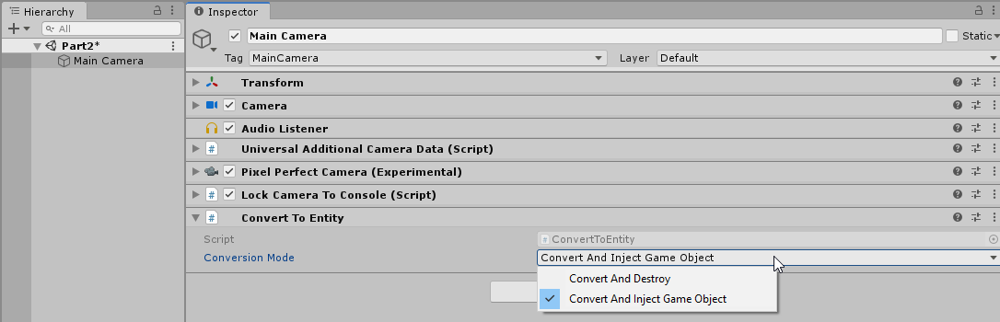
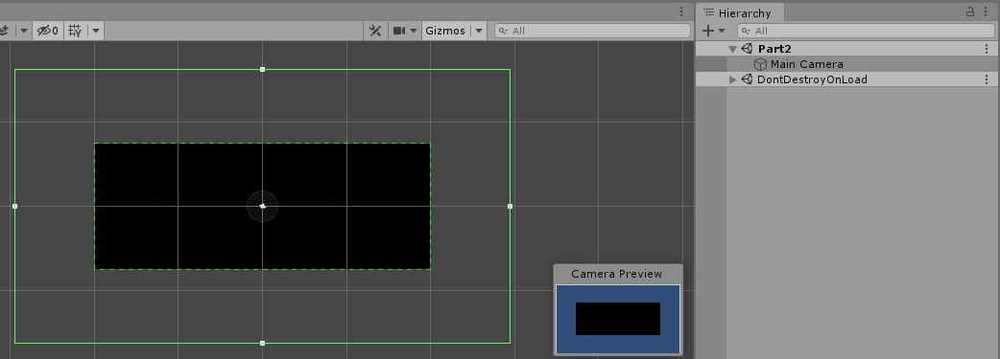
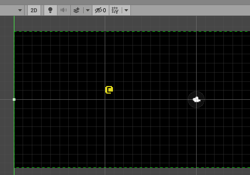
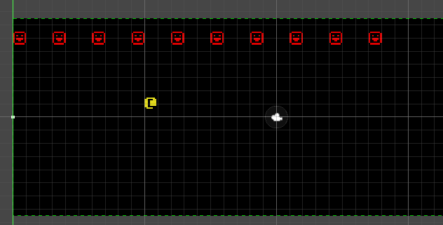

**([Back to Index](../../README.md)) - ([Previous: Part 1 - "Hello World"](../Part1/Part1-helloworld.md))- (Next: In Progress...))**

# Part 2 - ECS

In part two we're going to use Unity's ECS system to track some entities and 
render them in the console using their positions.

As of this writing Unity's ECS framework is **very much** in development. The API
seems to be stabilizing but there's a good chance that some aspects could
change in the future and things in this tutorial might not be up to date with
the latest changes. This tutorial was written using the Entities package v[0.4.0].

## Why Use ECS

I don't think I could come up with a better explanation of why one would want
to write a game using ECS than the one from [TheBracket's tutorial](https://bfnightly.bracketproductions.com/rustbook/chapter_2.html#about-entities-and-components),
which this tutorial is based off of. I want to highlight one particular paragraph:

```
For small games, an ECS often feels like it's adding a bit of extra typing 
to your code. It is. You take the additional work up front, to make life 
easier later.
```

This, in my experience, has been the biggest benefit of ECS. It scales very well, it
reduces coupling inherently by *forcing* you to separate your data from your behaviours and it forces you
to think about and format your data in a way that your computer can process very efficiently.

I am not saying one can't accomplish these things in OOP. But the bottom line is ECS makes it easier for *me*
to write cleaner and faster code. So I use ECS.

## Learning the "Basics" of ECS

Now with all that being said - this is *not* a tutorial about learning ECS. It's a tutorial about
writing a Roguelike *using* ECS. As I mentioned in the introduction I will try give a brief explanation of
what's happening as we write the code, but I couldn't possibly hope to exhaustively explain every
aspect of Unity's ECS and Job system while also trying to write the game. The concept of ECS has been around
for a long long time, but *Unity*'s ECS is fairly new and being actively developed. You'll need to
be able to do some research for yourself, dig into the source code sometimes, and make liberal
use of the documentation.

If you're new to ECS, I would **strongly** recommend these resources to learn the basics:
 * [The Unity ECS Samples](https://github.com/Unity-Technologies/EntityComponentSystemSamples/tree/master/ECSSamples/Assets/HelloCube) are a fantastic starting point. The "HelloCube" examples are extremely small and simple and the readme for each example gives a very clear explanation of what the code is doing. Don't even bother with anything else until you *thoroughly* understand what is happening in these samples. Download them, tinker around with them, and get familiar with them. As I said they are all very basic so it shouldn't take too long. 
 * [Getting Started with DOTS: Scripting Pong](https://www.youtube.com/watch?v=a9AUXNFBWt4) is a fantastic video. As of this writing it's the only up-to-date video tutorial from Unity that demonstrates how to write a simple game using ECS.
 * [The ECS Manual](https://docs.unity3d.com/Packages/com.unity.entities@latest) is essential while getting comfortable with the API. The manual itself is still being developed but it's come a long way. I highly recommend you keep the following pages open in another tab while you're learning ECS:
    * [General Purpose Components](https://docs.unity3d.com/Packages/com.unity.entities@0.4/manual/component_data.html)
    * [JobComponentSystem](https://docs.unity3d.com/Packages/com.unity.entities@0.4/manual/job_component_system.html)
    * [The Conversion System](https://docs.unity3d.com/Packages/com.unity.entities@0.4/manual/gp_overview.html#authoring-overview)
    * [Using JobComponentSystem and ForEach](https://docs.unity3d.com/Packages/com.unity.entities@0.4/manual/entities_job_foreach.html)

The last page in particular is a big one, but it's essential once you're comfortable
writing systems and components. It thoroughly demonstrates all the proper ways to access
and modify your entities while leveraging the job system and burst compiler to keep 
everything running as fast as possible.

If you're completely new to ECS, don't expect it to come to you easily. It requires you to 
structure your code in a very specific way. You will need to constantly refer back to the manual
and examples to be able to solve problems on your own. Googling will help, but be careful about finding
out-of-date information, the most up to date information will always be in the links I provided above.

If you're struggling and can't figure something out on your own with the resources above,
feel free to [ask in the official Unity discord](https://discord.gg/unity) (make sure you go to the "#Dots" 
channel for ECS related questions) or ask [on the forums](https://forum.unity.com/forums/data-oriented-technology-stack.147/). There's almost always people around willing to help, as long as you don't 
expect them to do all the work for you!

So now that you're equipped with the knowledge needed to try and solve any problems you might encounter 
when you want write ECS code, let's get started!

## Creating our RenderSystem

In order to get entities drawing to our console, we'll need to create a JobComponentSystem
that will iterate over our entities, read their position and render data, and then write to the console 
using that data. This is the basis of all Systems - read whatever data it's concerned with and 
act on it in some way, whether that's writing to other data, printing something to the log, or
in our case, drawing some smileys on screen.

To start with we create the bones of our system:

###### TileRenderSystem
``` csharp

[AlwaysSynchronizeSystem]
[AlwaysUpdateSystem]
public class TileRenderSystem : JobComponentSystem
{
    protected override void OnCreate()
    {
    }

    protected override JobHandle OnUpdate(JobHandle inputDeps)
    {
        return default;
    }
}
```

Something that might stick out immediately are the `[AlwaysSynchronizeSystem]` attribute and
`return default;`. These are how we tell Unity that this system won't be scheduling any threaded jobs -
it's going to do everything on the main thread. Typically systems do their work
in jobs off the main thread, but we're going to stay on the main thread for now to keep 
things relatively simple.

The `[AlwaysUpdateSystem]` attribute does what it says - it forces the system to always update.
Normally a system will only have it's `OnUpdate` function called when the entities it's 
querying for are present. Because our system is going to be drawing our console every frame, 
we want it to run at all times instead, even if there are no entities.

Now just by writing this we've defined a system that Unity will automatically manage. 
When you hit play, behind the scenes it will be properly initialized and have it's 
`OnUpdate` function called when necessary. And it's important to note that systems are not 
attached to any scenes. If you change scenes and press play, this system will be active. 

If you ever want to disable a system you can add the [DisableAutoCreation] attribute to it. 
You can learn more 
[from the documentation](https://docs.unity3d.com/Packages/com.unity.entities@0.4/manual/system_update_order.html?q=System%20Update). For this example we're only going to be using one
system so the default behaviour is fine, but as we move forward we'll have to put more thought
into how to manage the creation, upkeep, and order of many systems at once.

## Adding the Console

Of course our system is not going to do much as is - it needs a console to write to. 
The `SimpleConsoleProxy` we were using in the previous part is not really 
suitable for us in this case since we don't need a GameObject at all - in ECS all 
entities, components and system are completely separated from the traditional 
Unity hierarchy. Accessing MonoBehaviours from ECS is possible but should not be
the first solution you reach for.

Instead we're just going to use the base console class, [SimpleConsole](https://github.com/sarkahn/rltk_unity/blob/master/README.md#simpleconsole), 
which is intended for simple console usage from code on the main thread. We'll stick it in our 
system like so:

``` csharp
[AlwaysSynchronizeSystem]
[AlwaysUpdateSystem]
public class TileRenderSystem : JobComponentSystem
{
    SimpleConsole _console;

    protected override void OnCreate()
    {
        _console = new SimpleConsole(40, 15, Resources.Load<Material>("Materials/ConsoleMat"), new Mesh());
    }

    protected override void OnDestroy()
    {
        _console.Dispose();
    }

    protected override JobHandle OnUpdate(JobHandle inputDeps)
    {
        _console.ClearScreen();


        _console.Update();_
        _console.Draw();

        return default;
    }
}
```

The code should be pretty self-explanatory - we construct the console when the 
system is created (which again, happens automatically by Unity), and we make 
sure to call `Dispose` on the console when our system shuts down so it can 
[clean up it's internal data](https://github.com/sarkahn/rltk_unity#simpleconsole). The `Material` we're passing in to the console is 
the default one included in RLTK and is always accessible via `Resources.Load`.

Inside `OnUpdate` we clear the console, update it and tell it to draw.  The console's `Draw` 
function, will render the console's internal mesh using `Graphics.Draw`.

Now when you press play you should see an empty console:


You might also notice that the camera is no longer resizing itself to our console. This was
something that was handled automatically in the previous tutorial by the "Initialize Simple Console"
menu command. Since we're no longer relying on that, we need to manually attach the 
camera to our console. However, there's a problem. As I mentioned earlier we cannot access
MonoBehaviours from ECS without doing some extra work.

## The Conversion System

The Camera and it's accompanying `PixelPerfectCamera` and 
`LockCameraToConsole` components are MonoBehaviours. In order to access them we'll have 
to inject them into the ECS world using Unity's 
[conversion system](https://docs.unity3d.com/Packages/com.unity.entities@0.4/manual/gp_overview.html#authoring-overview).

This process may seem overly complicated, but this is an extremely important part of working with 
Unity's ECS. Right now some parts of Unity only exist as GameObjects, so it's essential 
to know how to bridge the gap between ECS land and GameObject land when necessary.

So - go to our Camera and add on the `LockCameraToConsole` component manually. It should
automatically add a `PixelPerfectCamera` component as well. Don't worry about changing 
any inspector settings on those, it will be done automatically once we attach the console 
to the LockCamera component in our code. 

Now add a `ConvertToEntity` component to the camera, and change it's "Conversion Mode" 
to "Convert and Inject GameObject". Your Camera should look similar to this now:


## Accessing the MonoBehaviour from our System

Now when you press play, all the components on the camera's GameObject will be "injected" into
the ECS world, meaning an entity will be created and all the components will be attached to it. 
We can now access our `LockCameraToConsole` component in ECS via that entity. 

We can't access it inside `OnCreate` since that gets called before Entity Conversion. Instead 
we'll override `OnStartRunning` and get our component there:

##### TileRenderSystem
``` csharp
    protected override void OnStartRunning()
    {
        var camEntity = GetSingletonEntity<LockCameraToConsole>();
        var lockCamera = EntityManager.GetComponentObject<LockCameraToConsole>(camEntity);
    }
```

If you're new to ECS there's probably a lot of unfamiliar things going on in those two 
lines of code, so I'll try to explain. 

`GetSingletonEntity` is a convenience method on our JobComponentSystem to retrieve an 
entity which contains the only instance of a certain component. In this case we want the
entity with out `LockCameraToConsole` component. 

Once we have the correct entity we get our `LockCameraToConsole` component from 
`EntityManager.GetComponentObject`. A "ComponentObject" is Unity's term for a 
MonoBehaviour that has been attached to an Entity, as opposed to `ComponentData` which are 
the typical value type  components derived from `IComponentData`.

And finally the `EntityManager` in ECS is responsible for managing all direct Entity and 
ComponentData access, whether reading or writing. If you need to create entities, add, read 
or change component data outside of a job, it's all done through the EntityManager attached 
to the JobComponentSystems. 

Hopefully all that is comprehensible. If you're confused about anything you've seen so
far, I encourage you to take a step back and revisit the learning references I provided earlier.

## Attaching the Camera

Since we have access to our `LockCameraToConsole` MonoBehaviour we can attach it to 
our console:

##### TileRenderSystem
``` csharp
    protected override void OnStartRunning()
    {
        var camEntity = GetSingletonEntity<LockCameraToConsole>();
        var attach = EntityManager.GetComponentObject<LockCameraToConsole>(camEntity);
        attach.SetTarget(_console, Vector3.zero);
    }
```

Now when you press play you should see the camera resizing itself to fit the console like
it was in the previous tutorial:



## Defining our Data

Our console is rendering properly in ECS, now it's time to create our entities. The first
thing we'll need is the rendering data that our system is going to operate on. You can create
these each in their own file, or try to group related components together in one file, whichever
you feel works better for you.

All ComponentData are derived from `IComponentData`:

##### Position
``` csharp
using Unity.Entities;
using Unity.Mathematics;

public struct Position : IComponentData 
{
    public float2 Value;
    public static implicit operator float2(Position c) => c.Value;
    public static implicit operator Position(float2 v) => new Position { Value = v };
}
```

This will represent the position of something in our world. The implicit operators
are not required but they tend to save you some typing when working with with 
single-value components. The second component will define the appearance of 
something in our world:

##### Renderable
``` csharp
public struct Renderable : IComponentData
{
    public Color FGColor;
    public Color BGColor;
    public byte Glyph;
}
```

## Iterating Over the Data

With our data defined, we can start to flesh out our renderer. For this example we just want it
to iterate over all entities with a `Position` and `Renderable` component. There are 
a few ways to go about this, but the easiest way is to define a `ForEach` in your system.
Go ahead and add this inside our `OnUpdate` function inside `TileRenderSystem`:

##### TileRenderSystem
``` csharp
    protected override JobHandle OnUpdate(JobHandle inputDeps)
    {
        _console.Clear();_

        Entities
            .WithoutBurst()
            .ForEach((in Position pos, in Renderable renderable) =>
        {

        }).Run();

        _console.Update();_
        _console.Draw();

        return default;
    }
``` 

If you're new to ECS this may look confusing, so I will try to explain.
The `ForEach` construct is a way of telling Unity to schedule a job that iterates 
over all entities with certain components, a `Position` and a `Renderable` component in
this case. We pass in a lambda to the `ForEach` which represents the code that will be
run on our components. For now our lambda is empty, so nothing happens yet.

You might notice I wrote "schedule a job", when I said earlier that we would be running
on the main thread. That's what `Run` does - it immediately runs the job on the main thread.
In that same vein `WithoutBurst` tells Unity to run the job without the burst compiler. These are
necessary because we'll be accessing a managed object from inside the job (the console), which is not
supported by either threaded jobs or burst.

In future parts we will get into using burst and jobs to maximize performance, but for now it's
more important to get down the basic concepts of iterating over components rather than worrying about
multi-threaded code.

The last unexplained bit would be the `in` keyword. When using components in a `ForEach` you have
to specify them with `in` or `ref`. `in` means the component is being accessed as read-only, and
`ref` means that you intend to make changes to the component. These keywords are necessary
for the safety system and we will go into more detail on why in future parts.

Now once again - if you're at all confused about anything you just read, I encourage you
to take a step back and review the documentation from earlier in the tutorial. The [manual page on ForEach](https://docs.unity3d.com/Packages/com.unity.entities@0.4/manual/entities_job_foreach.html)
in particular is absolutely vital while learning the syntax of `ForEach`.


## Rendering the Entities

Now we're iterating over our entities, but we're not actually doing anything with the data.
Let's fix that:

##### TileRenderSystem
``` csharp
        Entities
            .WithoutBurst()
            .ForEach((in Position pos, in Renderable renderable) =>
        {
            var p = (int2)pos.Value;
            _console.Set(p.x, p.y, renderable.FGColor, renderable.BGColor, renderable.Glyph);
        }).Run();
```

We read the relevant data and write it to the console, fairly straightforward. We're 
casting the position to `int2` because the console only accepts integer positions.
We originally store the positions as floats to allow for sub-tile movement over time. 


This will now render entities that have the matching components, but we haven't actually created them yet. 
We can do that in `OnCreate` for now:

##### TileRenderSystem
``` csharp
    protected override void OnCreate()
    {
        _console = new SimpleConsole(40, 15, Resources.Load<Material>("Materials/ConsoleMat"), new Mesh());

        var player = EntityManager.CreateEntity();
        EntityManager.AddComponentData<Position>(player, new float2(10, 8));
        EntityManager.AddComponentData<Renderable>(player, new Renderable
        {
            FGColor = Color.yellow,
            BGColor = Color.black,
            Glyph = RLTK.CodePage437.ToCP437('@')
        });
    }
```

Here we're using the EntityManager to create our entity and add our `Position` and 
`Renderable` components to it. `CodePage437` is a Utility class included with RLKT to 
make it easier to convert a `char` to a code page 437 glyph that can be understood by the console.

Now when you press play you should see the entity:

 

Let's create a few more entities inside `OnCreate`:

##### TileRenderSystem
``` csharp
        for (int i = 0; i < 10; ++i)
        {
            var e = EntityManager.CreateEntity();
            var renderable = new Renderable
            {
                FGColor = Color.red,
                BGColor = Color.black,
                Glyph = RLTK.CodePage437.ToCP437('☺')
            };
            EntityManager.AddComponentData<Position>(e, new float2(i * 3, 13));
            EntityManager.AddComponentData(e, renderable);
        }
```

Which gives us this scene:



## Moving the Entities

It's nice to finally see some entities, but it's a bit boring having everyone just
stand around. We'll create a new system to add a little behaviour to our red entities:

##### MoveLeft
``` csharp
struct MoveLeft : IComponentData
{
    public float Speed;
}

[AlwaysSynchronizeSystem]
public class MoveLeftSystem : JobComponentSystem
{
    protected override JobHandle OnUpdate(JobHandle inputDeps)
    {
        float dt = Time.DeltaTime;
        Entities.ForEach((ref Position p, in MoveLeft move) =>
        {
            p.Value.x += move.Speed * dt;
            if( p.Value.x < 0 )
                p.Value.x = 39;
        }).Run();
        return default;
    }
}
```

Most of this is similar to what we just did, but there's a few things to note. We don't need ot use 
`AlwaysUpdateSystem` since we only want this system to run on it's target components. 

We don't need to use `WithoutBurst`, because we're not touching any managed objects inside the job. 
Because we're not specifying it, the default behaviour is for jobs to run with Burst, even if 
they're running on the main thread. 

*Because* we're using Burst, we need to assign delta time to a local variable before using it 
in the job. Burst doesn't allow us to access managed/mutable static objects or any functions or
properties that access managed/mutable static objects, which Time.DeltaTime does.

This is a common convention when scheduling jobs - any work that accesses incompatible data should 
be done before scheduling and assigned to local variables before being passed into the job.

We're also using the `ref` keyword on our position, because we're modifying it. The order of 
our components in the lambda is important - as per the rules of [ForEach](https://docs.unity3d.com/Packages/com.unity.entities@0.4/manual/entities_job_foreach.html#lambda-parameters) 
we must pass writable parameters before read-only parameters.

Now we've defined a new behaviour, we can add it to our entities back in `TileRenderSystem.OnCreate`:

##### TileRenderSystem
``` csharp
    for (int i = 0; i < 10; ++i)
    {
        var e = EntityManager.CreateEntity();
        var renderable = new Renderable
        {
            FGColor = Color.red,
            BGColor = Color.black,
            Glyph = RLTK.CodePage437.ToCP437('☺')
        };
        EntityManager.AddComponentData<Position>(e, new float2(i * 3, 13));
        EntityManager.AddComponentData(e, renderable);
        EntityManager.AddComponentData(e, new MoveLeft { Speed = 15 });
    }
```

Now when we hit play we can see our new system in action:


## Handling Input

The red entities get to move around, now it's our turn. We want to be able to move our `@` character
around using the keyboard, so first we need to create the data that will be read from our job:


##### InputHandling
``` csharp
struct InputData : IComponentData
{
    public float2 Value;
}
```

We need one system to read the input and write to the data:

``` csharp
[AlwaysSynchronizeSystem]
public class ReadInputSystem : JobComponentSystem
{
    protected override JobHandle OnUpdate(JobHandle inputDeps)
    {
        float hor = Input.GetAxisRaw("Horizontal");
        float ver = Input.GetAxisRaw("Vertical");

        Entities.ForEach((ref InputData input) =>
        {
            input.Value.x = hor;
            input.Value.y = ver;
        }).Run();

        return default;
    }
}
```

Notice again the pattern of assigning static data to local variables and passing it in to the 
Bursted job. We also need another system to read our data and apply the movement:

##### InputHandling
``` csharp
[AlwaysSynchronizeSystem]
public class MovePlayerSystem : JobComponentSystem
{
    protected override JobHandle OnUpdate(JobHandle inputDeps)
    {
        float dt = Time.DeltaTime;
        Entities.ForEach((ref Position pos, in InputData input) =>
        {
            pos.Value += input.Value * 10 * dt;
        }).Run();

        return default;
    }
}
```

And finally we add the `InputData` to our player entity in `TileRenderSystem.OnCreate`:

##### TileRenderSystem
``` csharp
    var player = EntityManager.CreateEntity();
    EntityManager.AddComponentData<Position>(player, new float2(10, 8));
    EntityManager.AddComponentData<Renderable>(player, new Renderable
    {
        FGColor = Color.yellow,
        BGColor = Color.black,
        Glyph = RLTK.CodePage437.ToCP437('@')
    });
    EntityManager.AddComponentData<InputData>(player, new InputData());
```

When we press play, we can move around with WASD or the arrow keys:


Of course this type of "smoothed" movement is not typical for traditional roguelikes, but serves us 
for demonstration purposes.

## Conclusion

And that's it for this part of the tutorial. That was a lot of information to digest - keep
the documentation close at hand and don't be afraid to poke around the source code of anything
you don't yet understand.

**([Back to Index](../../README.md)) - ([Previous: Part 1 - "Hello World"](../Part1/Part1-helloworld.md))- (Next: In Progress...))**
