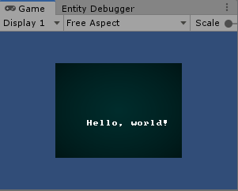
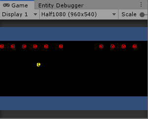
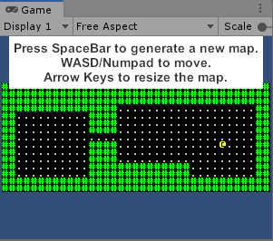
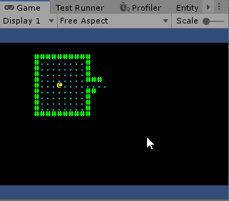
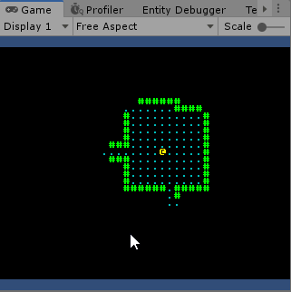
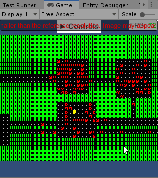

# Unity ECS Roguelike Tutorial

This is a set of tutorials for creating a "traditional" ascii based roguelike in Unity. They are based off TheBracket's excellent [Roguelike Tutorial in Rust](https://github.com/thebracket/rustrogueliketutorial), and created in Unity 2019.3.06f with the Entities package v 0.5.1. Please read the introduction if this is your first time here. 

This is very much a work in progress. Feel free to [open an issue](https://github.com/sarkahn/rltk_unity_roguelike/issues) if you see any obvious mistakes or errors. 

-----

### [Introduction](Assets/Introduction.md) 

----

 
  ### [Part 1.0 - Writing to the Console](Assets/Part1-HelloWorld/1.0-WritingToTheConsole/README.md)

Demonstrates how to create a MonoBehaviour-based `SimpleConsoleProxy` and how to write to it from another script.

-----

### [Part 1.1 - ECS](Assets/Part1-HelloWorld/1.1-ECS/README.md)

Provides a brief introduction to ECS with plenty of reference material to learn more. Shows how to spawn some entities using Unity's Conversion System and how to handle input for moving the player entity around.

---

### [Part 1.2 - Walking a Map](Assets/Part1-HelloWorld/1.2-WalkingAMap/README.md)

Shows how to generate a map for the player to run around in. The parameters for map generation can be tweaked in the editor via the entity conversion script and the map can be resized and regenerated at runtime.

-----

### [Part 1.3 - A More Interesting Map](Assets/Part1-HelloWorld/1.3-AMoreInterestingMap/README.md)

Generates a map more akin to the original "Rogue" maps of rooms and hallways.

-----

### [Part 1.4 - Field of View, Interfaces, and Reactive Systems](Assets/Part1-HelloWorld/1.4-FieldOfView/README.md)

Demonstrates how to create an FOV and "memory" system for exploring maps, how to use interfaces to create an API in jobs and burst, and gives a brief explanation of "Reactive Systems" in ECS.

-----

### [Part 1.5 - Monsters and Refactoring](Assets/Part1-HelloWorld/1.5-Monsters/README.md)

Goes over some code refactoring so our systems can apply behaviour to more entities than the just the player and generates some monsters in our map.

-----

### [Part 1.5A - Taking a Turn](Assets/Part1-HelloWorld/1.5A-TakingATurn/README.md)

Covers an implementation of a turn-based system in Unity's ECS framework, as well as introducing the first parts of a combat system.

-----

These tutorials will always be free and the code will always be open source. With that being said I put quite a lot of work into them. If you find them useful, please consider donating. Any amount you can spare would really help me out a great deal - thank you!

-----------
