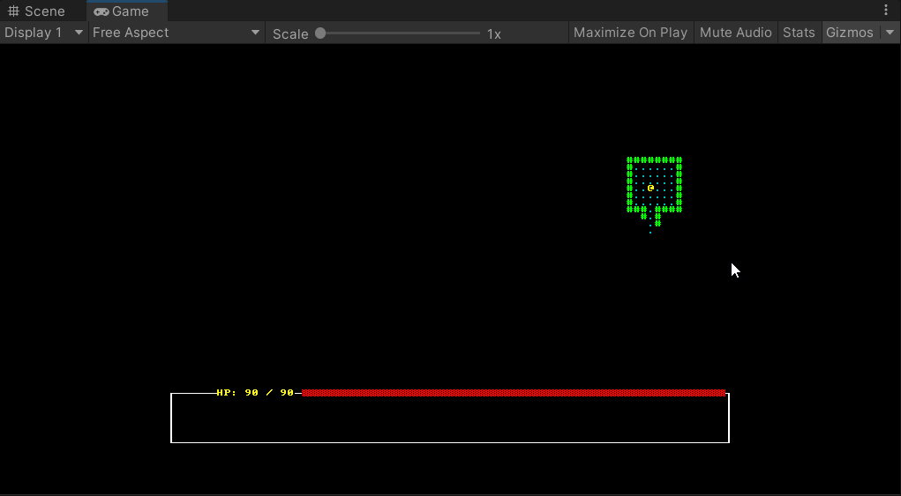
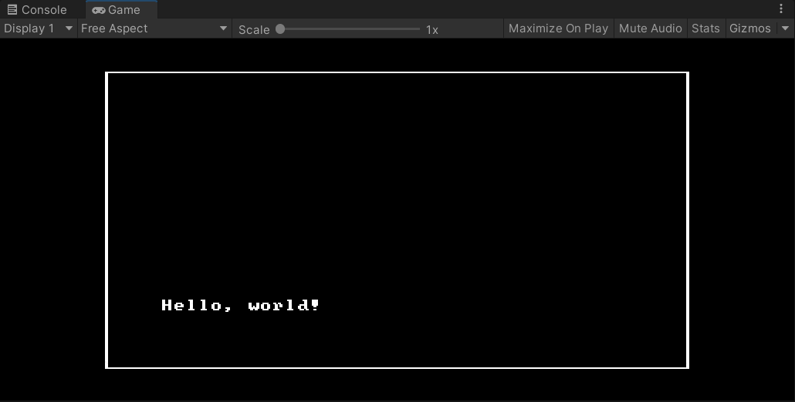

# Unity ECS Roguelike
A "traditional" ascii roguelike built using Unity's ECS/DOTS framework. This project is based on the excellent [Rust Roguelike Tutorial](https://bfnightly.bracketproductions.com/rustbook/) by TheBracket. Pull requests and bug reports are welcome!



### Playing The Game
You can run the game in the editor from the "Assets/DotsRogue/Scenes/DotsRogue" scene. In the game you can move in 9 directions using "QWEASDZXC", the keypad, or in the cardinal directions using the arrow keys. You can open your inventory with "I" and use items with the corresponding letter, and you can pick up items with "G".

### Project Structure
The project consists of the game itself in the "DotsRogue" folder, and several libraries in the "Lib" folder.

Of particular interest is the "Terminals" library which handles all the rendering for the game. It's built to be fast and efficient, and is completely Burst and Job safe. The terminal will only re-build it's internal mesh when it's been written to.

# Using the Terminal
Terminals are fully integrated with ECS. To create a terminal authoring object you can use the menu item "GameObject/Terminals/Create Terminal" and modify it's size and position in the editor. For correct rendering you should also create a Tiled Camera ("GameObject/TiledCamera/Create"), and ensure the terminal is centered and sized properly for the camera. **Incorrect terminal/camera positioning will cause noticable rendering artifacts.** 

After you've created it via the menu option, the terminal authoring object should spawn with a ConvertToEntity script on it. When you play your scene, the terminal will be converted to it's entity representation.

To write to the terminal from code you need to retrieve a "TerminalJobContext" on the main thread and call "GetAccessor" which returns an accessor object which you can use to write to the terminal. If you want to write to the terminal from inside a job you should pass the "TerminalJobContext" into the job first. You can then call "GetAccessor" from inside the job. This is necessary to avoid dependency issues from accessing the underlying buffer data on the main thread. For example:

``` csharp
using Unity.Entities;

using Sark.Terminals;

[UpdateInGroup(typeof(LateSimulationSystemGroup)]
public class HelloWorldSystem : SystemBase
{
    protected override void OnUpdate()
    {
        var termCTX = new TerminalJobContext(this, GetSingletonEntity<Terminal>());
        Job.WithCode(() =>
        {
            var term = termCTX.GetAccessor();
            term.ClearScreen();
            term.DrawBorder();
            term.Print(5, 5, "Hello, world!");
        }).Schedule();
        Enabled = false;
    }
}
```



You can see a more complete example of this process in the [RenderSystem](Assets/DotsRogue/Rendering/Rendering.cs) class.